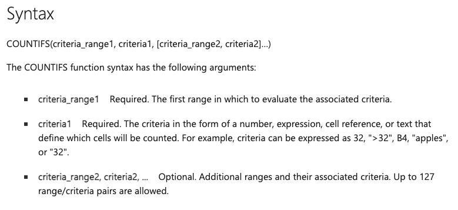
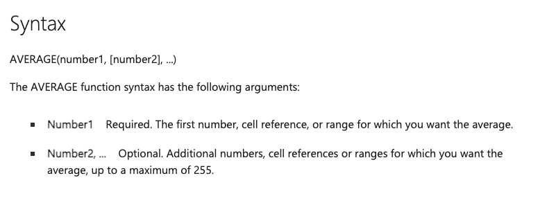
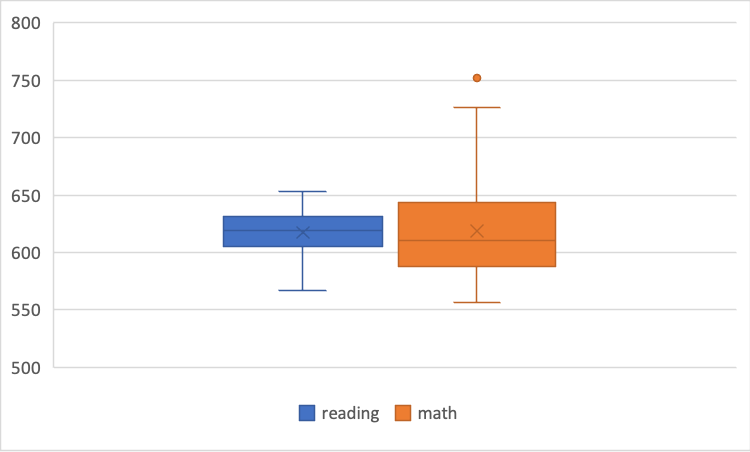
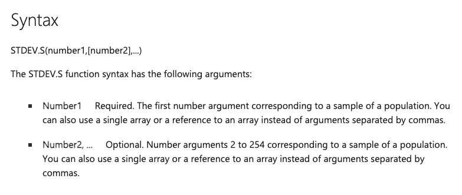

# Getting Started With Data Sets

Week 2 tutorial goals:
 
 Using Microsoft Excel to understand
 
 + Structure of datasets 
 + Basics of a function

## Understanding data sets

  + Open “STAR_small.csv” using Microsoft Excel.


  + What do you think this dataset is about?


  + How many rows and columns are there?


  + Look at the first column, “classtype”.
     * What are the unique entries in the variable “classtype”?


## Basics of a function

### Consider the first variable in the data set {-}

  + Report the number of 'small' and 'regular' entries in the first variable using the `COUNTIFS()` function

  + To use functions, we need to know the **arguments** accepted in a function and how to specify each of these arguments
  
  + Description of  `COUNTIFS()` from Microsoft’s [documentation](https://support.microsoft.com/en-us/office/countifs-function-dda3dc6e-f74e-4aee-88bc-aa8c2a866842):

```{r echo=FALSE, out.width = "70%", fig.align = "center"}

```

  + Try inserting this formula to a cell in the excel sheet:

<center> `=COUNTIFS(A2:A50,"small")`</center>

  + And then this formula:

<center> `=COUNTIFS(A2:A50,"regular")` </center>


### Next variables, “reading” and “math”. {-}

  + We are going to use the `AVERAGE()` function in Microsoft Excel. 
  
  + Description of the function according to Microsoft’s [documentation](https://support.microsoft.com/en-us/office/average-function-047bac88-d466-426c-a32b-8f33eb960cf6):

```{r echo=FALSE, out.width = "70%", fig.align = "center"}

```

  + Try inserting this formula to a cell in the excel sheet:

<center> =AVERAGE(B2:B50) </center>


  + What is the formula to retrieve the mean for “math”?


  + What is the formula to retrieve the mean for “reading” for the first 25 rows of the data?


  + Repeat the above three points for the median value using the `MEDIAN()` function.
  
  
  
### Measures of dispersion {-}

  + This is a box and whiskers plot of the reading and math variables. 

```{r echo=FALSE, out.width = "70%", fig.align = "center"}

```


  + The bottom and top of the box mark the 25th and 75th percentile of the data. Retrieve the 25th and 75th percentile of both variables using the `QUARTILE.INC(array, quartile)` function. The `quartile` argument takes values 0 (minimum), 1 (25th percentile) , 2 (50th percentile), 3 (75th percentile) , 4 (maximum).

Reading:  
25th percentile –  
75th percentile –  
  
Math:  
25th percentile –   
75th percentile –   


  + The bottom and top of the whiskers mark the minimum and maximum value of the data if they are within 1.5 times of the interquartile range. Retrieve the maximum and minimum values using the `QUARTILE.INC()` or `MAX()` and `MIN()` functions. 

Reading:  
Minimum –  
Maximum –  
  
Math:  
Minimum –   
Maximum –   

  + Which variable do you think has a larger standard deviation—reading or math?


  + Retrieve the standard deviation using the function  `STDEV.S()`. 

  + Description of the function according to Microsoft’s [documentation](https://support.microsoft.com/en-us/office/stdev-s-function-7d69cf97-0c1f-4acf-be27-f3e83904cc23):

```{r echo=FALSE, out.width = "70%", fig.align = "center"}

```

