# Intro to R

Week 3 tutorial goals:

  * R Basics 
    + Object types
    + Packages
    + Working directory
    + Importing data
    + Exploring data
  
```{css, echo=FALSE}
.watch-out {
  background-color: lightpink;
  border: 3px solid maroon;
  font-weight: bold;
}
```

## RStudio

```{r setup, include=FALSE}
knitr::opts_chunk$set(echo = TRUE,message=F)
library(tidyverse)

options(warn = -1) # suppress warning messages that do not disturb the program flow
```

### What is R? What is coding? {-}
  + Coding is a language that is fed directly into an interpreter. 
  + Programming languages are fed into a computing system that reads the script and executes the commands.
  + Non-programming languages simply translates the programming language into its corresponding output, e.g. Hypertext Markup Language (HTML). HTML is often used to display information on webpages. 
```{r echo=FALSE, out.width = "70%", fig.align = "center"}
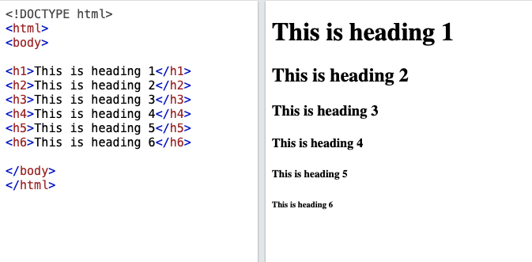
```
  + E.g. of other programming languages: JavaScript; Python; Mac Terminal (bash); Windows Command Prompt
  + `R` is a software for statistical computing. It is designed with particular processes that are tailored to statistical analysis and graphics. In order to initiate those processes, we write our commands in an R script for R to interpret and execute.
  
### Integrated Development Environment (IDE) editor: RStudio {-}
RStudio is a software that makes R more user-friendly. If you run the software R, you see only a single panel, which is not very informative. 

```{r echo=FALSE, out.width = "70%", fig.align = "center"}
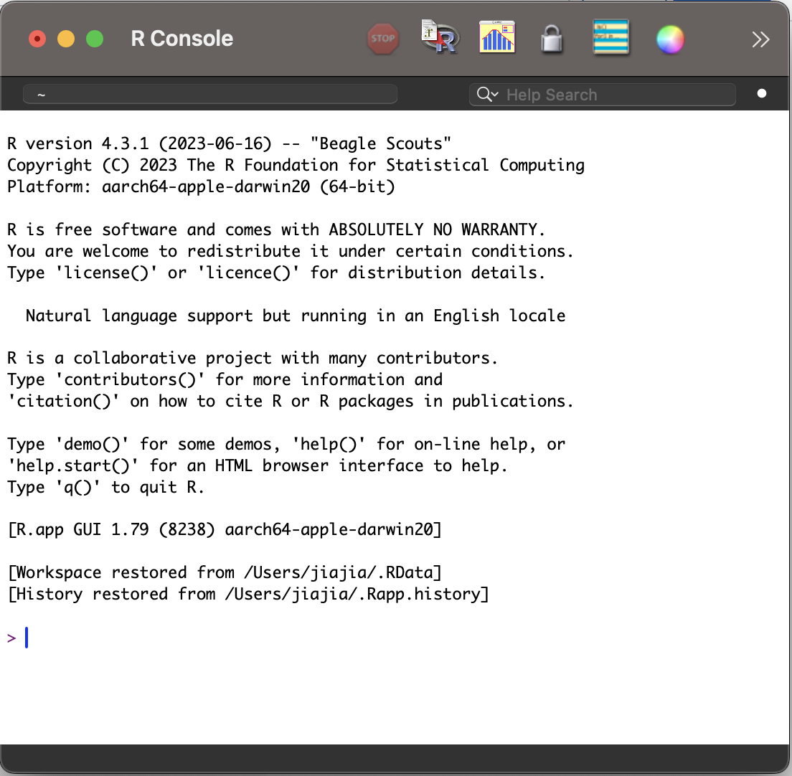
```


RStudio gives you more panels in addition to the R console (on the left) that displays information to support our use of R.

```{r echo=FALSE, out.width = "90%", fig.align = "center"}
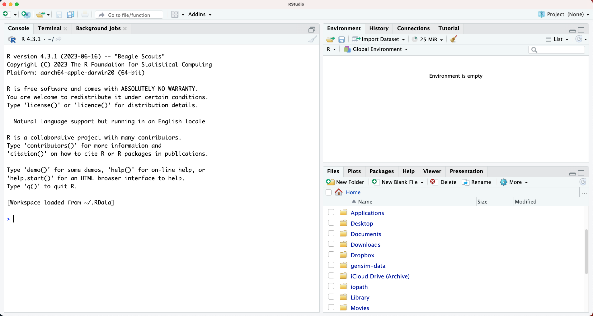
```

#### Console {-}
```{r echo=FALSE, out.width = "90%", fig.align = "center"}
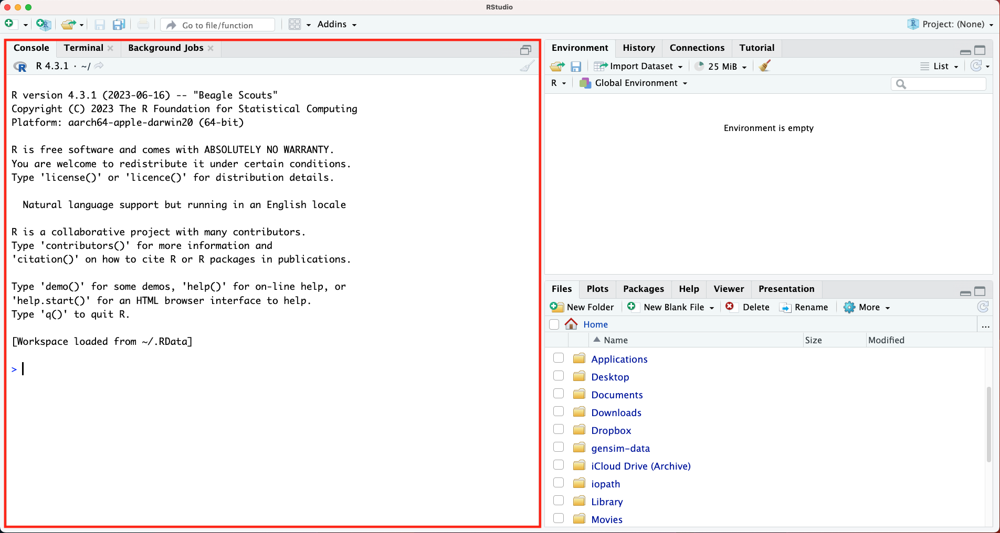
```

#### Environment {-}
The environment lists the objects you have saved and are able to "call" (i.e. use in subsequent commands).
```{r echo=FALSE, out.width = "90%", fig.align = "center"}
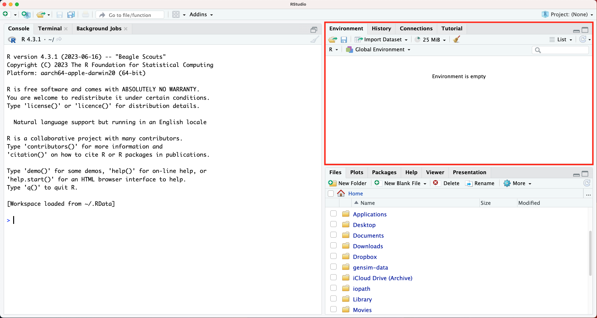
```

#### Files/Plots {-}
```{r echo=FALSE, out.width = "90%", fig.align = "center"}
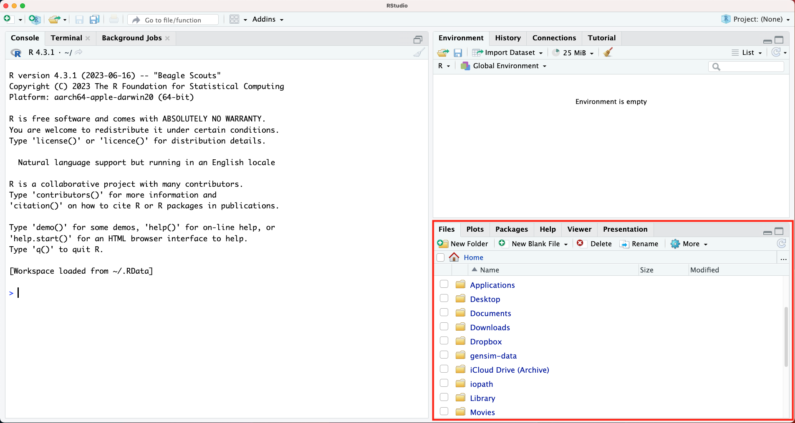
```


#### R Script {-}
You can try to run codes in the console, but running codes linearly can be restricting, kind of like using a typewriter instead of a word document---you have to redo everything when you make a mistake.
```{r echo=FALSE, out.width = "90%", fig.align = "center"}
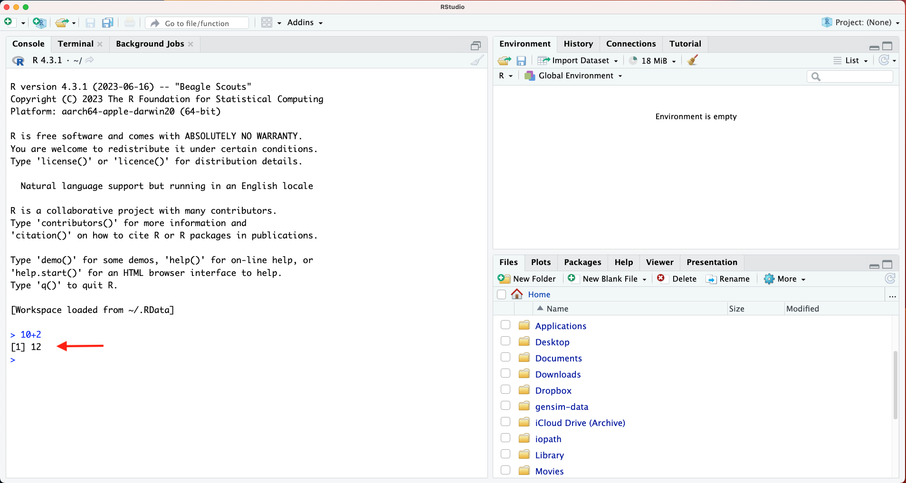
```

In order to create our code document, we need the R script.
```{r echo=FALSE, out.width = "90%", fig.align = "center"}
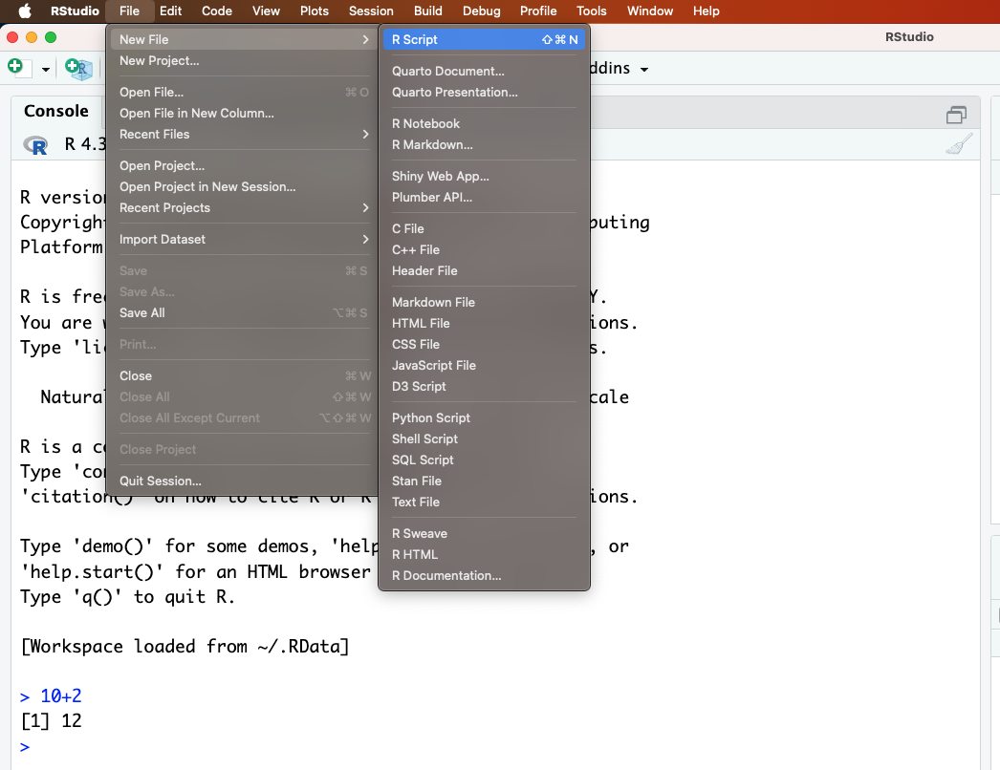
```

```{r echo=FALSE, out.width = "90%", fig.align = "center"}
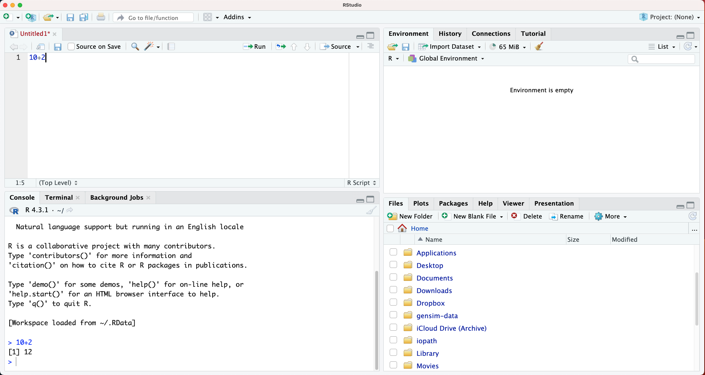
```

#### Open the R script `W3.R` {-}

The file `W3.R` can be found in the folder for this class (Quercus > Files > Practical > Week 3). This R script contains all the codes I will run below. You can run them on your computers as you follow along.

##  Getting started

###  A sophisticated calculator {-}
`R` can do whatever your calculator can do, and much more.
```{r}
0 * 10
10 + 5
round(0.25839012,digits=2)
round(0.25839012,digits=5)
```


### Objects {-}
Objects store data. You can assign objects using `<-` or `=`. In general, we use `<-` for assignment. There are distinctions between the two that are not relevant to the content here.

The way to assignment object is to type `<object name> <- <data>`. For example,
```{r}
obj1 <- 15
```

You will see `obj1` added to your environment panel. "Names of objects can only contain letters, numbers, _ (underscore), or . (period), and *must begin with a letter*" ([An Introduction to R for Research](https://bookdown.org/rwnahhas/IntroToR/naming-objects.html), emphasis added).

### Functions {-}
Similar to what we did in Excel last week. Functions are what makes R useful. 

Understanding a new function. Use `?<functionname>` to pull up the R documentation for the function. For example, one of the basic functions we need to learn is `c()` which allows you to combine data. The function `mean()` allows you to calculate the mean value, similar to the AVERAGE function we used in Microsoft Excel last week.
```{r}
?c()
?mean()
```

We can use `c()` to combine elements, such as numbers. We can then run a function like `mean()` on the combined output.
```{r}
c(10,20)
```

We assign a new object and run `mean()` on the new object.
```{r}
obj2 <- c(10,20)

mean(obj2)
```


### Comments {-}
`R` does not evaluate lines starting with `#`. This allow us to add glosses to our code
```{r}
?mean() # this function runs R documentation for function mean()
```


### Data types {-}

Data types tell `R` how the object should be read. Why do they matter? They affect what calculations can be done and how functions work. Words or labels can be specified using quotations `"`. These are known as characters in R. The function `class()` will tell you what kind of data type a variable is. Now lets create two objects, one with numbers and one with characters.
```{r}
numbers <- c(10,19,100)
words <- c("cat ate my homework","today","100 pianos")

class(numbers)
class(words)
```

The exact same numbers can be read as numbers or characters. The numbers 1, 2, 3 could refer to the `numeric` type, or they could refer to the labels "1", "2", "3", which are the `character` type.
```{r,echo=F}
eg1 <- c("1","3","2")
```

```{r,eval=F}
eg1 <- c("1","3","2")
mean(eg1) # characters have no mean
```

```{r}
class(eg1)
```

There are six basic data types: character, numeric, integer, logical, complex, raw. We will only be using numeric, character, and logical types. 

### Data frames {-}
Now, we want something closer to a dataset. We can use the column bind function `cbind()` to join two equal-length vectors. Let's create two variables
```{r}
id <- c(1,3,2) # the first variable, let's say we have three student ids 1,2,3
score <- c(250, 450, 800) # they scored 250, 450, 800 respectively
```


```{r}
eg2 <- cbind(id,score) #forms a matrix with two numeric columns
```

View the newly created object `eg2` using `view()` function.
```{r, eval=F}
View(eg2)
```

Note that using `cbind()` (column bind) function creates a matrix, which can only contain one class of data, leading to a coercion of all elements to the same class.
```{r}
# coercion
eg1 <- cbind(c("1",3,2),c(250,450,800))  # note eg1 in your Environment is marked 'chr' indication whereas eg2 is marked 'num'
```

If we want a mix of different data types in the same table, we use the `data.frame()` function. Each variable, however, can only take be one data type. If you input a mix of character and numeric elements, they will be coerced to character for that variable, similar to the previous example above.
```{r}
eg1 <- data.frame(v1 = c("a","c","b"),
                  v2 = c(250,450,800)) # notice that "=" is used here for local assignment
eg2 <- data.frame(v1 = c(1,2,3),
                  v2 = c(250,800,450))
```

View each data frame.
```{r,eval=F}
View(eg1)
View(eg2)
```


###  Base R vs. packages {-}
R comes with a set of base commands that allows you to do a range of statistical tasks. For example, let's try using plotting using base R functions and the object eg2.
```{r}
?plot() # Generic X-Y Plotting
```

```{r echo=FALSE, out.width = "70%", fig.align = "center"}
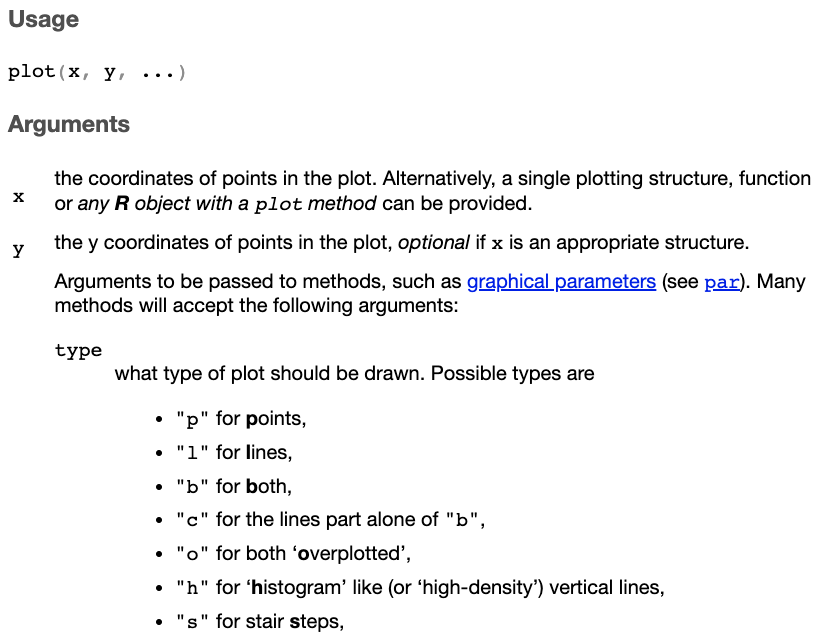
```


We need to specify arguments `x`, `y`, and type of plot `type`. To select one column from a dataframe, use `$` to specify column.
```{r}
plot(x = eg2$v1,
     y = eg2$v2, 
     type = "l")
```

#### Tidyverse {-}
R, as an open-source software, allows users to built functions using the basic functions within R. To load these additional user-built functions, we have to download and load packages. Tidyverse is a package we will be using throughout this course.
```{r, eval=F}
install.packages("tidyverse")
# you only need to install packages once
library(tidyverse) # you have to load the package every time you restart an R session
```

Try using the `ggplot` function from the tidyverse package. This is complex. Don't worry if you don't understand what the code is doing. Just run it. We will be using the function repeatedly over the next few weeks.
```{r}
# eg1
ggplot(data = eg1, aes(x = v1, y = v2)) + geom_line() # eg1 is unable to plot a line because v1 is a character type

# eg2
ggplot(data = eg2, aes(x = v1, y = v2)) + geom_line()
```
  

## Working directory and importing data
You can find out your current working directory by using the function getwd(). Your working directory is the root folder where R begins to retrieve any information.
```{r,eval=F}
getwd()
```

#### Opening file `STAR.csv` {-}
If the file is not in the current working directory, you can either
 + 1. Move the file to your working directory
 + 2. change your working directory (if on Mac, go to your top bar, Session > Set Working Directory > Choose Directory, and select the location where your file is located), 
 + 3. alternatively, if the file is in a subfolder of your current working directory, you can retrieve it by stating the path.
 
We are going to use the function `read.csv()`, which takes a file path for its first argument.
```{r,eval=F}
# the basic way to load a csv file
?read.csv()

paste0(getwd(),"/STAR.csv") # this will give you a string for the STAR.csv file if it is in your current directory
```

```{r,eval=F}
read.csv(paste0(getwd(),"/STAR.csv")) # this will read the file if it is in your current working directory
```
But that was just for illustration purposes. This can get cumbersome when dealing with multiple files. 

### R project to organize our workflow {-}
  + `File` > `New Project...`
  + The location of your new project will become the default working directory. You don't have to set your working directory every time you reopen RStudio.
```{r echo=FALSE, out.width = "70%", fig.align = "center"}
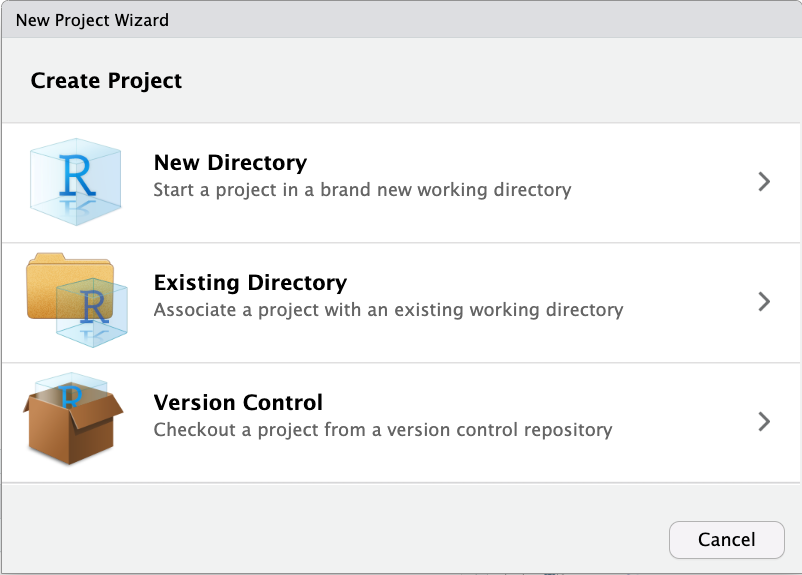
```


If you are not using your own laptop, save it on a portable storage, e.g. OneDrive or your thumbdrive.
```{r echo=FALSE, out.width = "70%", fig.align = "center"}
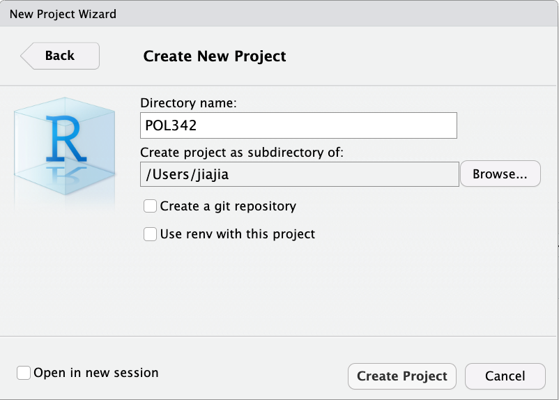
```

You should see a fresh view of RStudio with the project name on top.
```{r echo=FALSE, out.width = "70%", fig.align = "center"}
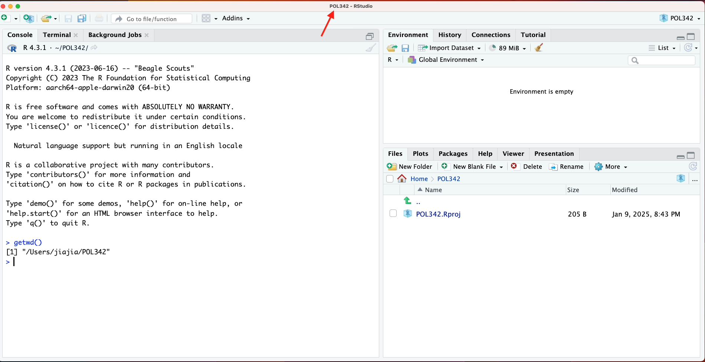
```


#### Save `STAR.csv` in the R project folder {-}
```{r echo=FALSE, out.width = "70%", fig.align = "center"}
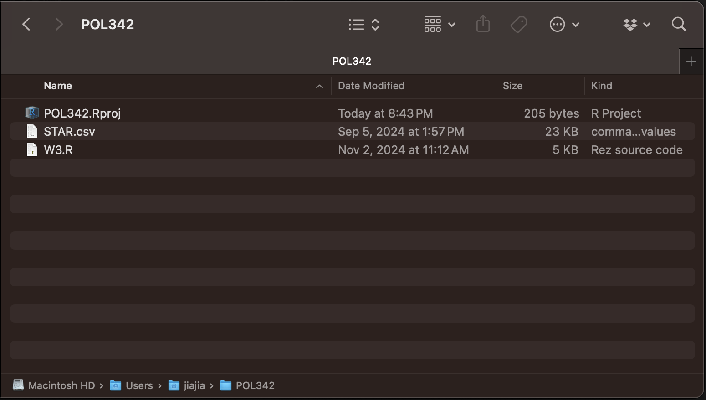
```

Check your file path
```{r,eval=F}
getwd()
```


You should be able to run the following code if your directory matches the location of the file.
```{r,echo=F}
star <- read.csv("data/STAR.csv")
```

```{r,eval=F}
star <- read.csv("STAR.csv") # reads the data file as stores it as object "star"
```

###  Exploring the data {-}
Now, we are going to do what we tried to do something similar to what we did with Microsoft Excel last week.
```{r,eval=F}
View(star) # look at the data
```

```{r}
head(star) # shows the first six rows
```

  + Identify the number of observations and names of variables
```{r}
dim(star) # provides dimensions of dataframe: rows, columns

colnames(star) # list variable names
```

  + Object type
```{r}
class(star$classtype) # column 1
```

  + Listing unique values for a column
```{r}
unique(star$classtype)
```

  + Calculating mean
```{r}
mean(star$reading) # calculates the mean of reading
mean(star$graduated) # calculates the mean of graduated
```

  + Finding mode
  + NOT `mode()`
```{r}
table(star$graduated) # tabulates all values in the column
sort(table(star$graduated)) # sorts by increasing order
```

  + What if there are too many unique values?
```{r}
table(star$reading)

sort(table(star$reading),decreasing=T) # sort by decreasing order

sort(table(star$reading),decreasing=T)[1] # limit to the first object in the table
```

  + Calculating median -- two methods: median(), quantile()

`median()`
```{r}
?median()

median(star$reading)
```

`quantile()`
```{r}
?quantile

quantile(star$reading, probs=.5)

## 25th percentile, 50th percentile, 75th percentile
quantile(star$reading, probs=c(.25,.5,.75))
```

  + Standard deviation
```{r}
sd(star$reading)
```

  + Another conveniant way to get mean and median
```{r}
summary(star$reading)
```

When you have questions about functions and don't find the R documentations helpful, you can always turn to search engines. Most of the questions that will come up in your process of learning to use R are likely to be found on **stackoverflow**, so just search your question in Google or other search engines (and remember to indicate `R` in your searches, if not, you might get answers for other computing languages).

## Notes for assignment 1

### Object name {-}
Object name assignment is important. If you name your data set `dat`, you should call upon the object `dat` whenever you want to use that object. 
```{r,eval=F}
dat <- read.csv("STAR.csv")

class(dat$reading)
```

### Removing objects using `rm()` {-}

`rm()` is a function that accepts two types of arguments,

1. the objects to be removed, as names (unquoted) or character strings (quoted)
2. list -- a character vector (or NULL) naming objects to be removed

#### Method 1 {-}
If you want to remove one object, you can use the function `rm()` and insert the object name as the argument. For example,
```{r,eval=F}
rm(dat)
```

#### Method 2 {-}
If your environment is cluttered and you want to clear everything in your environment without restarting the R session, you can use the function
```{r,eval=F}
rm(list = ls()) # ls() is a function that outputs all object names in the environment
```


### Restarting R sessions and clearing workspace {-}

When you are working on something new, you should always restart your R session and clear your workspace. 
```{r}
rm(list=ls())
```

Start a new R session by going to Session > Restart R
```{r echo=FALSE, out.width = "70%", fig.align = "center"}
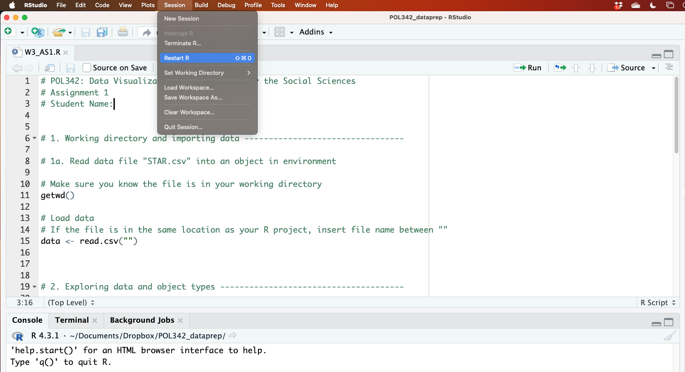
```

Note: Depending on your default setting, restarting R session may not clear your environment. If so, you can do it by clicking on Session > Clear Workspace...

### Checking code before submission {-}

Before submitting your code, clear your workspace and restart an R session. Then, select your entire R script and run the code. Your R script should run from beginning to end with no errors.

## Additional Resources
  + [An Introduction to R for Research, chapter: Introduction](https://bookdown.org/rwnahhas/IntroToR/intro.html)
  + Practise R on your own using [Swirl: Learn R, in R](https://swirlstats.com/students.html)
```{r, eval=F}
install.packages("swirl")
library(swirl)
swirl()
```


## Credits
* This lesson includes materials from
  + [Data Analysis for Social Science](https://scholar.harvard.edu/ellaudet/DSS)
  + [Statistical Inference via Data Science: A ModernDive into R and the Tidyverse](https://moderndive.com/index.html)
  
