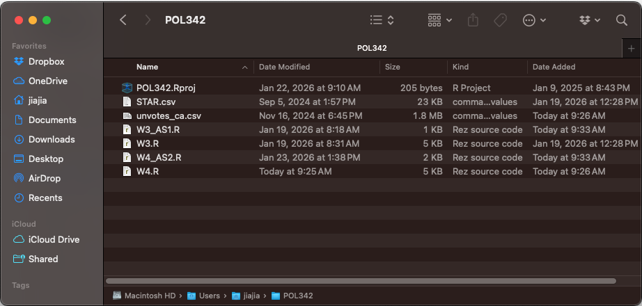
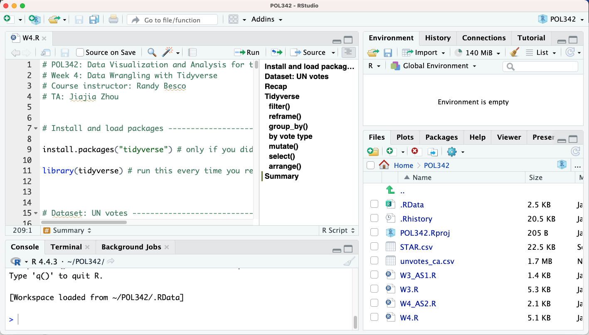

# Data Wrangling with Tidyverse

Goals for today's class:

  * Tidyverse basics for datasets
    + `filter()`
    + `reframe()`
    + `group_by()`
    + `mutate()`
    + `arrange()`
    + `select()`


## Before the start of each class
You should download the `.R` script and dataset from the Quercus folder for this week (Files > Practical > Week 4). Move the files to the .R project folder we created last week. Your folder should look something like this now:

```{r echo=FALSE, out.width = "80%", fig.align = "center"}

```

Open RStudio using your `.Rproject` file and follow along using the `W4.R` script.
```{r echo=FALSE, out.width = "80%", fig.align = "center"}

```
    
## Install and load packages
```{r, echo=F}
library(tidyverse)
```

```{r, eval=F}
install.packages("tidyverse") # if you haven't

library(tidyverse)
```

## Dataset: UN votes

The data for UN votes here come from the package "unvotes." You can find out more about the package here: https://github.com/dgrtwo/unvotes and  
https://cran.r-project.org/web/packages/unvotes/unvotes.pdf 

Know your current directory and where the data file is. You should be using the R project you created last week.
```{r, eval=F}
getwd() #run to display working directory
```

### Read file as `unvotes` data.frame object {-}
The following code will work if you have `unvotes_ca.csv` file in your R project folder.
```{r,include=F}
unvotes <- read.csv("data/unvotes_ca.csv")
```

```{r,eval=F}
unvotes <- read.csv("unvotes_ca.csv")
```

| variable      | desc.                                                                                                                                      |
|---------------|--------------------------------------------------------------------------------------------------------------------------------------------|
| rcid          | The roll call id; used to join with un_votes and un_roll_call_issues                                          |
| country       | Country name, by official English short name                                                                                               |
| country_code  | 2-character ISO country code                                                                                                               |
| year          | Year in which vote took place                                                                                                              |
| vote          | Vote result as a factor of yes/abstain/no                                                                                                  |
| session       | Session number. The UN holds one session per year; these started in 1946                                                                   |
| importantvote | Whether the vote was classified as important by the  U.S. State Department report "Voting Practices in the United Nations".  These classifications began with session 39 |
| date          | Date of the vote, as a Date vector                                                                                                         |
| unres         | Resolution code                                                                                                                            |
| amend         | Whether the vote was on an amendment; coded only until 1985                                                                                |
| para          | Whether the vote was only on a paragraph and not a resolution; coded only until 1985                                                       |
| short         | Short description                                                                                                                          |
| descr         | Longer description                                                                                                                         |
| short_name    | Two-letter issue codes                                                                                                                     |
| issue         | Descriptive issue name             


### View the data {-}
```{r,eval=F}
View(unvotes)

# or display first few rows of the data
head(unvotes,5)
```

```{r,echo=F}
head(unvotes,5)
```


## Recap

We are going to spend around 15-30 minutes practising what we learnt last week.

* Try answering the following questions based on what we learnt last week:
    + What are the names of the 15 variables in the dataset? (Hint: `colnames()`)
    + What are the data types of variables `vote` and `issue`? (Hint: `class()`)
    + What are the unique values in `vote` and `issue`? (Hint: `unique()`)
    + Could you provide a tally of the data under `vote`? (Hint: `table()`)
    + What is the median `year` in the dataset?

## Tidyverse

### Pipes {-}
Two types of piping `|>` (base R) and `%>%` (magrittr). The differences are not meaningful for this course. We will be using the `|>` pipe for simplicity.

Tidyverse pipes facilitate a sequence of actions performed on **a single object**. After every action, the `|>` is used to indicate that the output of the previous action is used as the input of the next action.

To make sure the pipe runs, the function must be able to take the piped object as its first argument.
```{r}
## the following codes are equivalent
#Base R
summary(unvotes)

#Tidyverse
unvotes |> summary()
```


### Piping data frames {-}

In this course, our focus is on data sets (i.e. data frames). Hence for the rest of today's class, we will focus on six tidyverse functions that are developed for the purpose of manipulating data frames.

* Tidyverse functions for datasets
    + `filter()` : subsets the data based on a conditional statement
    + `reframe()` : collapses/summarizes the dataset to produce stated summary statistics (e.g. `mean()`)
    + `group_by()` : divides the data based on specified groups so that subsequent functions can be run on each group separately
    + `mutate()` : creates a new variable (i.e. new column) in the dataset
    + `arrange()` : order the rows based on a criterion
    + `select()` : keep columns using their variable names (columns not specified are dropped from the dataset)

### filter() {-}
The `filter()` function allows you to slice out parts of the data based on your criterion.
```{r,eval=F}
# Subset only rows in the 60th UNGA session and save as new object
unvotes |> 
  filter(session==60)
```


```{r}
sess60 <- unvotes |> 
  filter(session==60)

# top 8 rows in the session 60 subset
head(sess60,8)
```
To understand how to `filter` datasets based on a certain criterion, we need to understand how to construct conditional statements using operators.

#### Conditional statements and operators {-}

Conditional statements produce `logical` class (i.e. TRUE or FALSE) output that help us to manipulate objects as well as customize the execution of functions.

Operators are used to construct conditional statements.

* Comparison operators
  + Equal `==` 
  + Not equal `!=`
  + More than `>`
  + Less than `<`
  + Greater than or equal to `>=`
  + Less than or equal to `<=`
* Logical operators
  + And `&`
  + Or `|`
  + Not `!`
* Miscellaneous operator
  + In `%in%`

#### Run a few examples to see how they work {-}

* 5 MORE THAN 3
```{r}
5 > 3
```


* 10 LESS THAN -100
```{r}
10 < -100
```


* "3 more than 5" AND "3 more than 1"
```{r}
(3 > 5) & (3 > 1)
```

* "3 more than 5" OR "3 more than 1"
```{r}
(3 > 5) | (3 > 1)
```

* 1 EQUALS TO 3
```{r}
1 == 3
```

* "apple" EQUALS TO "apple"
```{r}
eg <- "apple"
eg2 <- "banana"

eg == "apple"
eg2 == "apple"
```

* 1 NOT EQUALS TO 3
```{r}
1 != 3
```

By inserting these conditional statements into the `filter` function, we can create subsets of the dataset.
```{r}
afterColdWar <- unvotes |> 
  filter(year > 1990)

# top 8 rows in the subset containing data after 1990
head(afterColdWar,8)
```


### reframe() {-}
The `reframe()` function creates a new data frame (often having the effect of reducing/summarizing the data frame) based on selected functions, e.g. `mean()`, `unique()`, `n()`(number of observations) etc.

By using `reframe(min(year))`, the code collapses the data to produce only the minimum year
```{r}
unvotes |>
  reframe(min(year))
```

You can produce more than one summary statistic.
```{r}
unvotes |>
  reframe(yearmin = min(year), # minimum year
          yearmax = max(year), # maximum year
          yesvotes = sum(vote=="yes"), # total number who voted "yes"
          yesshare = sum(vote=="yes")/n()) # total number voted "yes" divided by total number of observations, n()
```

Note that in the `sum` function ahove, a conditional statement `vote=="yes"` is inserted so that the total number of votes can be tallied. This is possible because `TRUE` takes the value of 1 and `FALSE` takes the value of 0). For example,

| vote | based on conditional statement | value |
|------|--------------------------------|-------|
| "yes"|                TRUE            |   1   |
| "no" |                FALSE           |   0   |
| "no" |                FALSE           |   0   |
| "yes"|                TRUE            |   1   |

Output of `sum` function in this example will be 2.

### group_by() {-}
The `group_by()` function allows you to apply functions to subsets of the data. If we use `group_by(year)`, the subsequent functions will be applied separately to each group with the same `year` value.
```{r}
# by year
unvotes |>
  group_by(year) |>
  reframe(yesvotes = sum(vote=="yes"),
            yesshare = sum(vote=="yes")/n()) # n() -- number of observations

# by vote type
unvotes |>
  group_by(vote) |>
  reframe(votes = n()) # n() -- number of observations
```


### mutate() {-}
The `mutate()` function allows you to add new columns to your dataframe. For example, if you wanted to retain the original dataframe while calculating the mean, max, and yes vote shares in each year, you can apply the same functions using `mutate()` instead of `reframe()`
```{r}
new_unvotes <- unvotes |>
  group_by(year) |>
  mutate(yesvotes = sum(vote=="yes"),
         yesshare = sum(vote=="yes")/n()) # n() -- number of observations
```

View your new variables
```{r,eval=F}
new_unvotes$yesvotes

View(new_unvotes)
```


### select() {-}
The `select()` function allows you to reduce the dataset by selecting only the variables you are interested in, or it can also be used to reorder your dataset.
```{r}
un_small <- unvotes |>
  select(country,year,issue,vote)

head(un_small,10)
```


### arrange() {-}
The `arrange()` function simply reorders the dataset by the variable of your choice.
```{r}
unvotes |>
  filter(year==1990) |>
  reframe(issue=unique(issue)) |>
  arrange(issue)
```


## Summary
Piping is useful when the output you want requires a series of operations. For example, the following operations tallies the number of "yes", "no", "abstain" votes in each year, and creates a new data frame by assignment the pipe to a new object `unvotes_2015`.
```{r}
unvotes_2015 <- unvotes |>
  filter(year==2015) |> # subset data in 2015
  group_by(vote) |> # group_by allows functions to run separately for each unique element in variable
  reframe(n()) # n() -- number of observations
```

This is how the new data frame looks
```{r}
unvotes_2015
```

#### Another example {-}
Let's say we are interested in the issue of "Human rights," and we want to know the yearly share of all the different votes that Canada has cast between 1990 to 2010. How would we do it?
```{r}
# first find out what vote types there are
unique(unvotes$vote)

# then, wrangle the data
unvotes |>
  filter(year>1990 & year<2010 & issue=="Human rights") |> # three conditions in one statement
  group_by(year) |>
  reframe(yesshare = sum(vote=="yes")/n(),
            noshare = sum(vote=="no")/n(),
            abstainshare = sum(vote=="abstain")/n()) # n() -- number of observations
```


## More resources

* Tidyverse pipes: [Tidyverse style guide, 4 Pipes](https://style.tidyverse.org/pipes.html)
* Non-Tidyverse pipes: [R for Data Science, chapter 18](https://r4ds.had.co.nz/pipes.html)
* Data wrangling in general: [ModernDive, chapter 3](https://moderndive.com/3-wrangling.html#filter)


## Credits

* This lesson uses materials from
  + [Statistical Inference via Data Science: A ModernDive into R and the Tidyverse](https://moderndive.com/index.html)
  + [unvotes](https://github.com/dgrtwo/unvotes)
