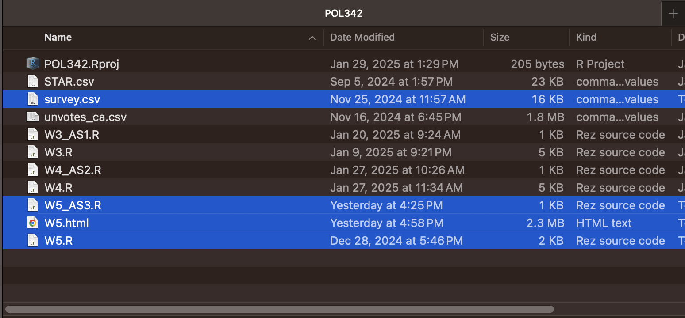
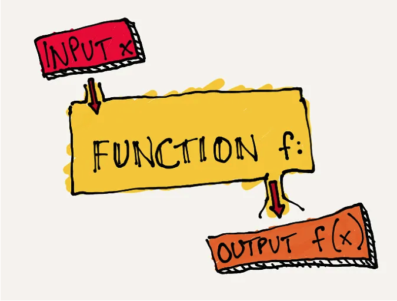
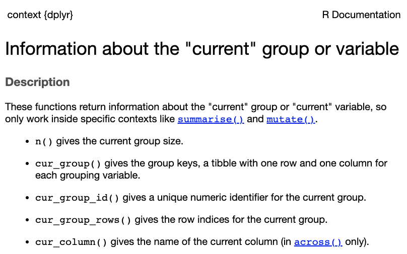
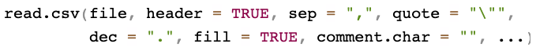
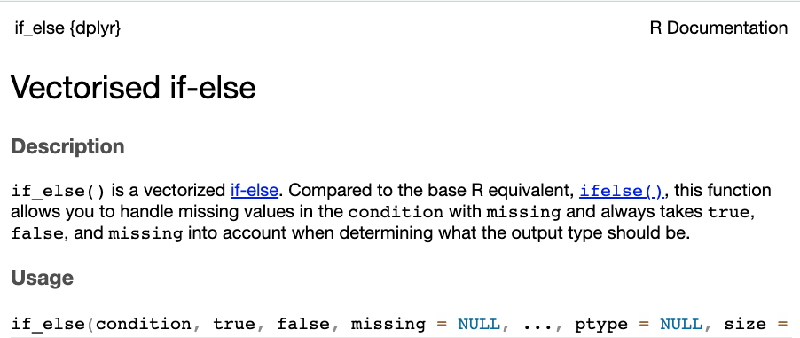
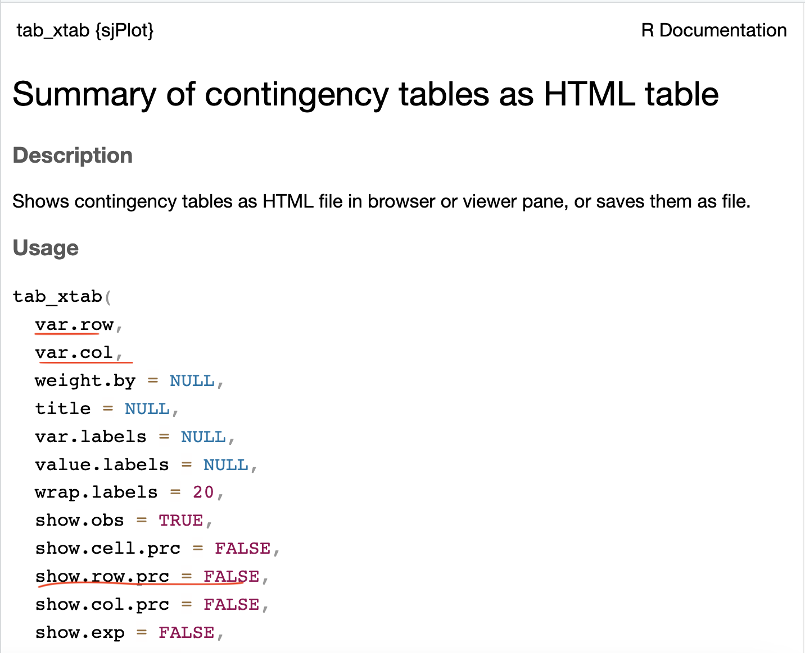

# Data visualization

* Goals for today's class:

  * More on manipulating variables
    + `if_else()`
  * Single variables using `ggplot`
    + Categorical (nominal/ordinal)
      + bar chart -- `geom_bar()`
    + Continuous (interval/ratio)
      + histogram -- `geom_histogram()`
  * Bivariate relationships
    + crosstabs -- `tab_xtab()` from `sjPlot`
    + visualizing crosstabs with stacked bar chart `geom_bar()`
    + box plot `geom_boxplot()`
    + scatter plot `geom_point()`

## Before the start of each class

### Download files from Quercus {-}

Move all the files into your R project `.Rproj` folder.
```{r echo=FALSE, out.width = "70%", fig.align = "center"}

```


### Install new package and load all packages required for this class {-}
```{r, include=FALSE}
knitr::opts_chunk$set(message=F)
library(tidyverse)
library(sjPlot)
options(warn = -1) # suppress warning messages that do not disturb the program flow
```

```{r,eval=F}
install.packages("sjPlot")
library(sjPlot)

library(tidyverse)
```

## Load data
We will be using two data sets today, one from last week---Canada's votes at the UNGA---and the other is an experimental data.
```{r,eval=F}
df <- read.csv("unvotes_ca.csv")
survey <- read.csv("survey.csv")
```

```{r,echo=F}
df <- read.csv("data/unvotes_ca.csv")
survey <- read.csv("data/survey.csv")
```


## Recap and some additional basics

### R scripts {-}

R scripts should be complete in itself. Before submitting your assignments, start a new session, clear your workspace, select the entire code (i.e. "Select All") and run everything. You should not get any errors.


### Syntax for functions: `<functionname>(<argument(s)>)` {-}

Functions are a fixed series of actions done to an object. The syntax will always begin with the function name, followed by `()`.

```{r echo=FALSE, out.width = "70%", fig.align = "center"}

```

(Image credit: https://medium.com/swlh/7-programming-concepts-functions-6072d7c50278)

In some cases, functions may not have arguments, for example, `n()`. The following is the documentation for `n()`,
```{r echo=FALSE, out.width = "70%", fig.align = "center"}

```

### Arguments are function-specific {-}

Last week we learnt the following tidyverse functions

  * filter()
  * group_by()
  * mutate()
  * reframe()
  * select()
  * arrange()

`filter()` takes expressions that produce a logical value, i.e. conditional statements
```{r}
df |>
  filter(year==1983 & importantvote==1)
```


`group_by()` take either variables or conditional statements
```{r,eval=F}
df |>
  group_by(session)

#or

df |>
  group_by(year>1989)
```

`mutate()` and `reframe()` take variable assignment arguments. For `mutate()`, the original data frame is retained and new variables/columns are added to the data frame. For `reframe()` the data frame is reduced to the size of the new object.


### Missing values {-}

If a variable contains missing (`NA`) values, summary statistics such as mean() and sum() will return `NA` unless the argument na.rm is specified TRUE, meaning missing values should be removed.
```{r}
df |>
  reframe(imptvote = sum(importantvote, na.rm=T)) # by default na.rm=FALSE
```


```{r}
df |>
  reframe(imptvote = sum(importantvote))
```

To see if a variable contains missing values, you can use a combination of `table` and `is.na()`. `is.na()` returns a same-length vector of `TRUE`/`FALSE` (`TRUE` if the value is missing and `FALSE` if the value is present).
```{r,eval=F}
is.na(df$importantvote)
```


```{r}
table(is.na(df$importantvote))
```


This tells us that the variable has 425 missing values.

`select()` and `arrange()` take variable names.
```{r, eval=F}
df |>
  select(country, year, issue)
```

### Argument names {-}

In many of the examples here, I omit the name of the argument. This is fine when we know the order of the arguments or when the function requires only one argument. For example, the following codes are equivalent.
```{r,eval=F}
read.csv(file="unvotes_ca.csv", header=T)

read.csv("unvotes_ca.csv", TRUE)
```

But that's only because I stated them in the right sequence. See the documentation,
```{r}
?read.csv
```

```{r echo=FALSE, out.width = "70%", fig.align = "center"}

```

Specifying the argument is a safe way to work with unfamiliar functions because it is fine if you get the sequence wrong.
```{r,eval=F}
read.csv(header=TRUE, file="unvotes_ca.csv")
```

This will give you an error.
```{r,eval=F}
read.csv(TRUE, "unvotes_ca.csv")
```


### `if_else()` function {-}
Let's say we want to create a new binary variable that denotes two separate periods, during and before/after the cold war.

```{r}
#read the if_else() documentation
?if_else
```

`if_else` takes a conditional statement as its first argument, followed by the replacement value if `TRUE` as the second argument, and replacement value if `FALSE` as the third argument. (Do you remember what a conditional statement is? See Section \@ref(conditional-statements)) 

```{r echo=FALSE, out.width = "70%", fig.align = "center"}

```

```{r}
df2 <- df |> 
  mutate(support = if_else(vote=="yes", # logical test
                          1, # TRUE/yes output
                          0)) # FALSE/no output
```

Find the new variable at the extreme right of the data set.
```{r,eval=F}
View(df2)
```


Quick exercise: Explain what each step of the following code executes and what variable `x` represents in the resultant output.
```{r}
df |>
  group_by(issue, importantvote) |>
  reframe(n = n()) |>
  group_by(issue) |>
  mutate(x = round(n/sum(n), 2))
```


## Data visualization


### `ggplot()` {-}

The `ggplot2` package contains functions tailored to making presentable and informative graphs. It works through piecing together separate pieces of graphical components joined by a `+` sign, beginning with the empty plane specified using the function ggplot().
```{r}
ggplot()
```
To begin plotting on `ggplot()`, you need to specify two components, 1. data, 2. x-axis and/or y-axis.

The x- and y- axes are specified under `aes()` which refers to aesthetic mappings. Aesthetic mappings describe how variables in the data are mapped to visual properties.

Integer/numeric (class) on x-axis
```{r}
ggplot(data=df, aes(x=importantvote))
```

Character (class) on the y-axis
```{r}
ggplot(data=df, aes(y=vote))
```


## Plots for categorical variables

### Univariate: nominal/ordinal {-}

Create frequency bar charts by adding `geom_bar()` to `ggplot()`
```{r}
ggplot(df2, aes(x=vote)) +
  geom_bar()
```

Note: Do not confuse geom_bar with another type of bar chart, `geom_col()`. `geom_bar()` summarizes the data into groups while `geom_col()` plots the values in the data.
```{r}
data <- data.frame(vote = c("abstain","no","yes"),
                   count = c(5,15,20))

ggplot(data, aes(x=vote,y=count)) +
  geom_col()
```

For clearer presentation of single variables, categories with long names can be plotted on the y-axis instead of x-axis.
```{r}
# poor presentation
df2 |>
  ggplot(aes(x=issue)) +
  geom_bar()
```

```{r}
# better presentation
df2 |>
  ggplot(aes(y=issue)) +
  geom_bar()
```


### Bivariate: two nominal/ordinal variables {-}

* Crosstabs and chi-square test -- tab_xtab()
```{r}
?tab_xtab
```

```{r echo=FALSE, out.width = "70%", fig.align = "center"}

```

Let's cross-tabulate Canada's votes on the six issues listed in the dataset. Independent variable in columns and dependent variables in rows. (Note: `tab_xtab` is not a tidyverse function. Hence, variable names should be preceded by object name of data frame and `$`)
```{r}
tab_xtab(var.col=df2$issue, var.row=df2$vote,
         show.col.prc = TRUE,
         show.row.prc = FALSE)
```


* Visualizing the contingency table with stacked bar plot

What we want:
```{r,echo=F}
df2 |>
  ggplot(aes(y=issue,fill=vote)) +
  geom_bar(position="fill") +
  xlab("Proportion")
```

**First step: `geom_bar()`**
```{r}
df2 |>
  ggplot(aes(y=issue)) +
  geom_bar()
```

**Second step: argument `fill`**


```{r}
df2 |>
  ggplot(aes(y=issue, fill=vote)) +
  geom_bar()
```

**Third step: argument `position`**
```{r}
df2 |>
  ggplot(aes(y=issue,fill=vote)) +
  geom_bar(position="fill") + # position="fill" sets each bar to the same height of 1
  xlab("Proportion")
```


## Plots for interval variables

### Survey experiment data {-}

Let us switch data sets here because the UN data set does not contain suitable interval/ratio variables for us to play with.

The data used in the following section is sourced from the replication data of the paper,\
Lee, Nathan. “Do Policy Makers Listen to Experts? Evidence from a National Survey of Local and State Policy Makers.” American Political Science Review 116, no. 2 (2022): 677–88. \ https://doi.org/10.1017/S0003055421000800. \
Replication data file: https://dataverse.harvard.edu/dataset.xhtml?persistentId=doi:10.7910/DVN/S2SNOT

Data comes from a survey fielded to policymakers (elected municipal officials, elected county officials, state legislators, state legislative staffers)

We use a simplified version of the data:

| variable      | desc.                                                                             |
|---------------|-----------------------------------------------------------------------------------|
| issue         | Needle exchange (1 out of 3 issues discussed in the paper).                       |
| treated       | 1 if treated, 0 if control. Treatment: Experts from several universities have examined this issue and concluded that needle exchanges do not increase drug use.                                          |
| preference    | Dependent variable 1: policy preferences (scaled 0-1). Do you support needle exchange? (Strongly support -- Strongly oppose)   |
| accuracy      | Dependent variable 2: belief accuracy (scaled 0-1). If you were to guess, what percentage of public health experts who conduct research related to needle exchanges believe these programs do NOT increase drug use? (Less than 20%, 20 - 40%, 40 - 60%, 60 - 80%, More than 80%)  |
| republican    | Party affiliation of the policymaker (1 if Republican, 0 if Democrat)             |
| age           | Age of the policymaker                                                            |
| gov_exp       | Over your career, how many years have you worked in government?                   |

Take a look at the data.
```{r,eval=F}
View(survey)
```

### Univariate: interval {-}

Create histograms by adding `geom_histogram()` to `ggplot()`
```{r}
survey |>
  ggplot(aes(x=age)) +
  geom_histogram()
```


### Bivariate: nominal/ordinal and interval {-}

**Note: numeric class objects are treated as continuous variables**
```{r}
class(survey$treated)
```

Box and whiskers by group -- `geom_boxplot()`
```{r}
# incorrect plot
survey |>
  ggplot(aes(x=republican,y=age)) +
  geom_boxplot()
```

** Factor class **
```{r}
class(factor(survey$republican))
```

Corrected using `factor()`
```{r}
survey |>
  ggplot(aes(x=factor(republican),y=age)) +
  geom_boxplot()
```


### Bivariate: two interval variables {-}

Scatter plot `geom_point()`
```{r}
ggplot(survey,aes(x=age,y=gov_exp)) +
  geom_point()
```

## Credits
* This lesson includes materials from
  * [unvotes](https://github.com/dgrtwo/unvotes)
  * [Fundamentals of Data Visualization](https://clauswilke.com/dataviz/visualizing-amounts.html)

