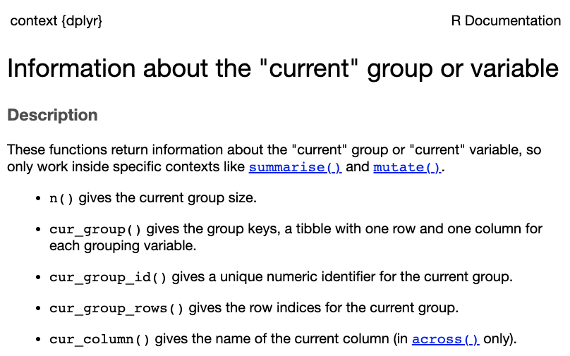
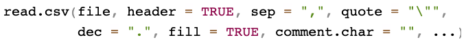
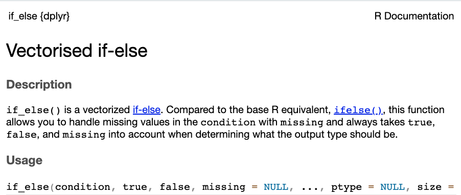
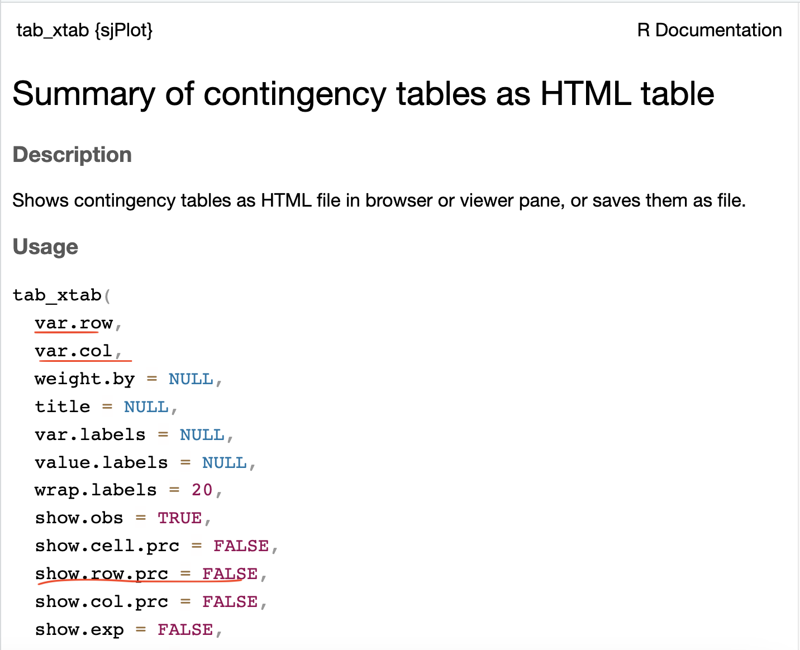

# Data visualization

Week 5 tutorial goals:

  * Recap and a few more basics
    + = versus ==
    + missing values (NA)
    + omitting/assuming arguments
    + `if_else()`
  * Single variables using `ggplot`
    + Categorical (nominal/ordinal)
      + bar chart -- `geom_bar()`
    + Continuous (interval/ratio)
      + histogram -- `geom_histogram()`
  * Bivariate relationships
    + crosstabs -- `tab_xtab()` from `sjPlot`
    + visualizing crosstabs with stacked bar chart `geom_bar()`
    + box plot `geom_boxplot()`
    + scatter plot `geom_point()`

## Before the start of each class

### Download files from Quercus {-}

Move all the files into your R project `.Rproj` folder

Open your R project


### Install new package and load all packages required for this class {-}
```{r, include=FALSE}
knitr::opts_chunk$set(message=F)
library(tidyverse)
library(sjPlot)
options(warn = -1) # suppress warning messages that do not disturb the program flow
```

```{r,eval=F}
install.packages("sjPlot")
library(sjPlot)

library(tidyverse)
```

## Load data
We will be using two data sets today, one from last week---Canada's votes at the UNGA---and the other is a survey of Canadians from the 2025 Canadian Election Study.
```{r,eval=F}
unvotes <- read.csv("unvotes_ca.csv")
ces <- read.csv("ces2025_small.csv")
```

```{r,echo=F}
unvotes <- read.csv("data/unvotes_ca.csv")
ces <- read.csv("data/ces2025_small.csv")
```


## Recap and some additional basics

### R scripts {-}

R scripts should be complete in itself. Before submitting your assignments, start a new session, clear your workspace, select the entire code (i.e. "Select All") and run everything. You should not get any errors.


### Syntax for functions: `<functionname>(<argument(s)>)` {-}

Functions are a fixed series of actions done to an object. The syntax will always begin with the function name, followed by `()`.

```{r echo=FALSE, out.width = "70%", fig.align = "center"}

```

(Image credit: https://medium.com/swlh/7-programming-concepts-functions-6072d7c50278)

In some cases, functions may not have arguments, for example, `n()`. The following is the documentation for `n()`,
```{r echo=FALSE, out.width = "70%", fig.align = "center"}

```

### Arguments are function-specific {-}

Last week we learnt the following tidyverse functions

  * filter()
  * group_by()
  * mutate()
  * reframe()
  * select()
  * arrange()

`filter()` takes expressions that produce a logical value, i.e. conditional statements
```{r}
unvotes |>
  filter(year==1983 & importantvote==1)
```


`group_by()` take either variables or conditional statements
```{r,eval=F}
unvotes |>
  group_by(session)

#or

unvotes |>
  group_by(year>1989)
```

`mutate()` and `reframe()` take variable assignment arguments. For `mutate()`, the original data frame is retained and new variables/columns are added to the data frame. For `reframe()` the data frame is reduced to the size of the new object.


### `=` versus `==` {-}

These look almost the same, but they do very different things.

  + `=` (one equals sign) **names** something: "make this equal to".
  + `==` (two equals signs) **checks** something: "is this equal to?" The answer is `TRUE` or `FALSE`.

Inside a function, `name = value` format is common

  + the name before the `=` is a new column name that you choose
  + the value after the `=` is what goes in that column

```{r}
unvotes |>
  reframe(meanyear = mean(year)) # new column called meanyear, equal to the mean of year
```

`==` is a conditional statement, like the ones we used with `filter()` last week. It checks every row and gives `TRUE` or `FALSE`. Since `TRUE` counts as 1 and `FALSE` as 0, the mean is the share of votes that were "yes".
```{r}
mean(unvotes$vote == "yes") # share of votes that were "yes"
```

Here we use both. `in_favour =` names a new column, and `vote == "yes"` checks each row to see if the vote was "yes".
```{r}
unvotes |>
  mutate(in_favour = vote == "yes") |> # new column called in_favour: TRUE if the vote was "yes"
  select(year, vote, in_favour) |>
  head()
```


### Missing values {-}

If a variable contains missing (`NA`) values, summary statistics such as mean() and sum() will return `NA` unless the argument na.rm is specified TRUE, meaning missing values should be removed.
```{r}
unvotes |>
  reframe(imptvote = sum(importantvote, na.rm=T)) # by default na.rm=FALSE
```


```{r}
unvotes |>
  reframe(imptvote = sum(importantvote))
```

To see if a variable contains missing values, you can use a combination of `table` and `is.na()`. `is.na()` returns a same-length vector of `TRUE`/`FALSE` (`TRUE` if the value is missing and `FALSE` if the value is present).
```{r,eval=F}
is.na(unvotes$importantvote)
```


```{r}
table(is.na(unvotes$importantvote))
```


This tells us that the variable has 425 missing values.

<!--
`select()` and `arrange()` take variable names.
```{r, eval=F}
unvotes |>
  select(country, year, issue)
```
-->

### Omitting Argument Names {-}

In many of the examples here, I omit the name of the argument. This is fine when we know the order of the arguments. For example, the following codes are equivalent.
```{r,eval=F}
read.csv(file="unvotes_ca.csv", header=T)

read.csv("unvotes_ca.csv", TRUE)
```

But that's only because I stated them in the right sequence. See the documentation,
```{r}
?read.csv
```

```{r echo=FALSE, out.width = "70%", fig.align = "center"}

```

Wrong order will give you an error!
```{r,eval=F}
read.csv(TRUE, "unvotes_ca.csv")
```


Specifying the argument is a safe way to work with unfamiliar functions because it is fine if you get the sequence wrong.
```{r,eval=F}
read.csv(header=TRUE, file="unvotes_ca.csv")
```


### `if_else()` function {-}
Let's say we want to create a new binary variable that is 1 if the vote is about weapons, and 0 for all other issues.

```{r}
#read the if_else() documentation
?if_else
```

`if_else` takes a conditional statement as its first argument, followed by the replacement value if `TRUE` as the second argument, and replacement value if `FALSE` as the third argument. 

  + Do you remember what a conditional statement is? See [Conditional statements and operators](#conditional-statements-and-operators) in the previous chapter.

```{r echo=FALSE, out.width = "70%", fig.align = "center"}

```


```{r}
unvotes_weapons <- unvotes |>
  mutate(weapons = if_else(issue == "Nuclear weapons and nuclear material", # logical test
                           1, # TRUE output
                           0)) # FALSE output
```

  + Note this makes a new object, `unvotes_weapons`. Good practice not to edit the original dataset, especially if we are change an existing variable or drop rows like with `filter()`.

This misses the votes on "Arms control and disarmament". Use `|` (or) to combine two conditional statements.

```{r}
unvotes_weapons <- unvotes |>
  mutate(weapons = if_else(issue == "Arms control and disarmament" |
                             issue == "Nuclear weapons and nuclear material", # logical tests, using |, the OR symbol
                           1, # TRUE output
                           0)) # FALSE output
```

Find the new variable at the extreme right of the data set.

  + Look at your data after running code to see if it worked like you wanted!
```{r,eval=F}
View(unvotes_weapons)
```


**Quick exercise**: Explain what each step of the following code executes and what variable `x` represents in the output.
```{r}
unvotes |>
  group_by(issue, importantvote) |>
  reframe(n = n()) |>
  group_by(issue) |>
  mutate(x = round(n/sum(n), 2))
```


## Data visualization


### `ggplot()` {-}

The `ggplot2` package contains functions tailored to making presentable and informative graphs. It works through piecing together separate pieces of graphical components joined by a `+` sign, beginning with the empty plane specified using the function ggplot().
```{r}
ggplot()
```

To begin plotting on `ggplot()`, you need to specify three components, 1. data, 2. x-axis and/or y-axis, 3. type of plot (geometry)

  + The x- and y- axes are specified under `aes()` which refers to aesthetic mappings. Aesthetic mappings describe how variables in the data are mapped to visual properties.

  + Types of plots are geometry. For example: geom_bar(), geom_histogram(), geom_point()


## Plots for categorical variables

### Univariate: nominal/ordinal {-}

```{r}
unvotes |>
  ggplot(aes(x=issue)) +
  geom_bar()
```

Plot on the y-axis instead of x-axis.
  
  + Sometimes better for long names

```{r}
# better presentation
unvotes |>
  ggplot(aes(y=issue)) +
  geom_bar()
```


### Bivariate: two nominal/ordinal variables {-}

* Crosstabs and chi-square test -- tab_xtab()
```{r}
?tab_xtab
```

```{r echo=FALSE, out.width = "70%", fig.align = "center"}

```

Let's cross-tabulate Canada's votes on the six issues listed in the dataset. Independent variable in columns and dependent variables in rows. (Note: `tab_xtab` is not a tidyverse function. Hence, variable names should be preceded by object name of data frame and `$`)
```{r}
tab_xtab(var.col=unvotes$issue, var.row=unvotes$vote,
         show.col.prc = TRUE,
         show.row.prc = FALSE)
```


* Visualizing the contingency table with stacked bar plot

What we want:
```{r,echo=F}
unvotes |>
  ggplot(aes(y=issue,fill=vote)) +
  geom_bar(position="fill") +
  xlab("Proportion")
```

**First step: `geom_bar()`**
```{r}
unvotes |>
  ggplot(aes(y=issue)) +
  geom_bar()
```

**Second step: argument `fill`**


```{r}
unvotes |>
  ggplot(aes(y=issue, fill=vote)) +
  geom_bar()
```

**Third step: argument `position`**
```{r}
unvotes |>
  ggplot(aes(y=issue,fill=vote)) +
  geom_bar(position="fill") + # position="fill" sets each bar to the same height of 1
  xlab("Proportion")
```


## Plots for interval variables

### Canadian Election Study data {-}

Let us switch data sets here because the UN data set does not contain suitable interval/ratio variables.

The data used in the following section comes from the 2025 Canadian Election Study (CES), a large survey of Canadians taken during and after the 2025 federal election.\
Stephenson, Laura B., Allison Harell, and Daniel Rubenson. 2025 Canadian Election Study (CES). [dataset]

We use a simplified version of the data with fewer variables. A missing value (`NA`) means the person did not answer the question or was not asked it. These are the variables we use today:

| variable      | desc.                                                                             |
|---------------|-----------------------------------------------------------------------------------|
| age           | Age of the respondent in years                                                    |
| born_canada   | Where the respondent was born: "Born in Canada" or "Born elsewhere"               |
| lib_rating    | How do you feel about the Liberal Party? (0 = really dislike, 100 = really like)  |
| con_rating    | How do you feel about the Conservative Party? (0 = really dislike, 100 = really like) |

Take a look at the data.
```{r,eval=F}
View(ces)
```

### Univariate: interval {-}

Create histograms by adding `geom_histogram()` to `ggplot()`
```{r}
ces |>
  ggplot(aes(x=age)) +
  geom_histogram()
```


### Bivariate: nominal/ordinal and interval {-}

Box and whiskers by group -- `geom_boxplot()`. The third box, `NA`, is the people who did not say where they were born.
```{r}
ces |>
  ggplot(aes(x=born_canada,y=con_rating)) +
  geom_boxplot()
```


### Bivariate: two interval variables {-}

Scatter plot `geom_point()`
```{r}
ggplot(ces,aes(x=lib_rating,y=con_rating)) +
  geom_point()
```

## Assignment tips

Section 2 of the assignment uses a different version of the UN votes data, `unvotes_country_1947.csv`.

  + In `unvotes_ca.csv`, each row is **one vote** by Canada.
  + In `unvotes_country_1947.csv`, each row is **one country**. It covers all UN member countries, but only for the year 1947.

| variable    | desc.                                                                                   |
|-------------|-----------------------------------------------------------------------------------------|
| country     | Country name                                                                            |
| votes       | Number of UN votes the country cast in 1947                                             |
| share_yes   | Share of the country's votes that were "yes", from 0 (none) to 1 (all)                  |
| ICAO_region | World region of the country (see below)                                                 |

The regions use codes from the International Civil Aviation Organization (ICAO):

  + AFI: Africa
  + ASIAPAC: Asia and the Pacific
  + CARSAM: Caribbean and South America (including Central America and Mexico)
  + EUR: Europe
  + MID: Middle East
  + NAM: North America

Look at the data with `View()` before you start!

## Credits
* This lesson includes materials from
  * [unvotes](https://github.com/dgrtwo/unvotes)
  * [Fundamentals of Data Visualization](https://clauswilke.com/dataviz/visualizing-amounts.html)

