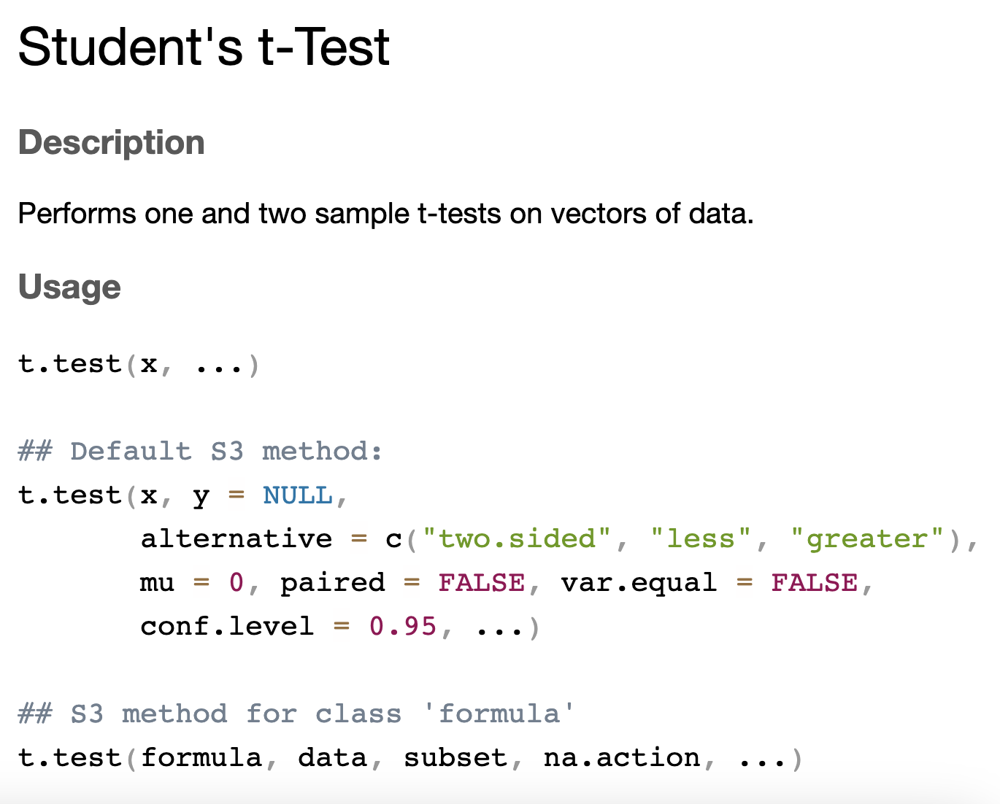
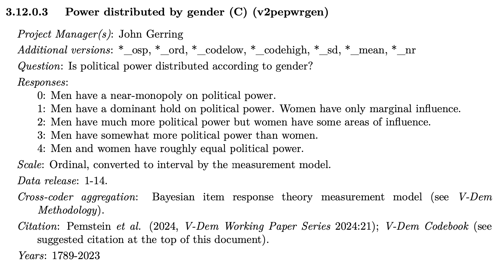

# Regression and confidence intervals

* Goals for today's class:
  * Difference in means -- `t.test()`
  * Linear regression -- `lm()`
  * Visualizing models using `ggplot`
    + estimates and confidence intervals -- `geom_pointrange()`
    + regression lines
      + `geom_smooth()` 
      + `geom_ribbon()`

## Before the start of class
```{r, echo=F}
library(tidyverse)
library(broom)
```

### Download files from Quercus {-}

```{r echo=FALSE, out.width = "70%", fig.align = "center"}

```

### Install new package and load all packages required for this class {-}
```{r,eval=F}
install.packages("broom")
library(broom)
library(tidyverse)
```

### Load data {-}
```{r,echo=F}
df <- read.csv("data/survey.csv")
un_country <- read.csv("data/unvotes_country_1946-7.csv")
```

```{r,eval=F}
df <- read.csv("survey.csv")
un_country <- read.csv("unvotes_country_1946-7.csv")
```

## Recap

### Converting variable to factor class {-}

* Republican 
```{r}
class(df$republican)
```

* ICAO_region
```{r}
unique(un_country$ICAO_region)
```

```{r}
ggplot(df, aes(x=factor(republican))) +
  geom_bar()
```


### Determining plot based on type of variable {-}

* Categorical (nominal/ordinal) and categorical -- Stacked bar chart `geom_bar`
* Categorical (nominal/ordinal) and numerical (interval/ratio) -- Box and whiskers `geom_boxplot`
* Numerical (interval/ratio) and numerical -- Scatter plot `geom_point`

```{r}
ggplot(un_country, aes(x=ICAO_region, y=share_yes)) +
  geom_boxplot()
```

## Experimental study data

Using the same survey data we used last week: the replication data of the paper,\
Lee, Nathan. “Do Policy Makers Listen to Experts? Evidence from a National Survey of Local and State Policy Makers.” American Political Science Review 116, no. 2 (2022): 677–88. \ https://doi.org/10.1017/S0003055421000800. \
Replication data file: https://dataverse.harvard.edu/dataset.xhtml?persistentId=doi:10.7910/DVN/S2SNOT

### Outcomes of interest in the study: {-} 
1. Beliefs about experts (If you were to guess, what percentage of public health experts who conduct research related to needle exchanges believe these programs do NOT increase drug use? {Less than 20%, 20–40%, 40–60%, 60–80%, More than 80%}) \
2. Policy preferences (Do you support or oppose the use of {needle exchange programs)? {Strongly support, Moderately support, Slightly support, Neither support nor oppose, Slightly oppose, Moderately oppose, Strongly oppose.}

### Treatment {-}
The study implements two types of experiments but we focus only on one aspect of it involving cross-subject design (i.e. participants are split into treatment and control groups). The theory being tested is *accuracy-motivated reasoning*. The authors hypothesize that policy makers will update their beliefs and preferences following exposure to information about experts. Three policy issues, with high degree of expert consensus but are highly politicized, are utilized in the study. We look at one of the issues on needle exchange.

Here is an excerpt of the treatment: \
A needle exchange program is a social service which provides clean needles to
drug users to reduce the spread of disease (like HIV or Hepatitis C). However, some people think
these programs encourage drug use. \
[(Treatment) Experts from several universities have examined this issue and concluded that needle exchanges do not increase drug use.]

### Data {-}
survey fielded to policymakers (elected municipal officials, elected county officials, state legislators, state legislative staffers) 

Display first five rows of the dataset.
```{r}
head(df,5)
```

## Difference in means -- `t.test()`

### Syntax {-}

```{r echo=FALSE, out.width = "70%", fig.align = "center"}

```

We are going to use the method involving a formula and data. Formulas are written in R by stating the name of the dependent variable and independent variable, separated by a `~`. In the case of experiments, the independent variable is the treatment and the dependent variable is the outcome of interest, i.e. `OutcomeOfInterest ~ Treatment`.

### Outcome 1: Beliefs about experts {-}
Be careful of the direction of the difference. By default, `t.test()` takes the mean of group 0 - mean of group 1 (in numerical order, alphabetical if the groups are denoted by strings).
```{r}
t.test(accuracy ~ treated, data = df)
```


In order to get the right direction of the effect, we need to reverse the factor order.
```{r}
t.test(accuracy ~ factor(treated, levels=c(1,0)), data = df)
```


### Outcome 2: Policy preferences {-}
```{r}
t.test(preference ~ factor(treated, levels=c(1,0)), data = df)
```


## Visualizing treatment effects

### Extract the output using `tidy()` from package `broom` {-}

By default, the output from a t.test is stored in its own unique class of output, which makes it hard for us to extract the data. `broom` is a package that helps us to convert these types of model output into a data frame. In particular, we use the function `tidy()` from `broom`. `tidy()` works on most analysis models in R. The tidy-ed output is as follows,

```{r}
t.test(accuracy ~ factor(treated, levels=c(1,0)), data = df) |>
  tidy()
```

### Interpreting the effect {-}

#### Mathematical interpretation {-}
Exposure to information regarding expert views of the issue led to a 9.88 percentage point increase in belief accuracy. The observed effect is statistically significant.

#### Substantive interpretation {-}
The increase in belief accuracy on the issue of needle exchange suggests that policy makers are receptive to new evidence about expert views.

### Estimates and confidence intervals -- geom_pointrange() {-}

Using the tidy-ed data frame, we can plot the estimate. Because the estimate is one-dimensional (you only need either x or y), the other dimension can be used as a name label instead of a variable.
```{r}
t.test(accuracy ~ factor(treated, levels=c(1,0)), data = df) |>
  tidy() |>
  ggplot(aes(y=estimate,x="belief about experts")) + 
  geom_pointrange(aes(ymax=conf.high,ymin=conf.low,))
```

`geom_pointrange()` **syntax** (**do not run the following code**)
```{r, eval=F}
ggplot(<name of dataframe>,
       aes(y = estimate, # from the tidy-ed output
           x = "name of x-axis label")) + # x will be the x-axis label
  geom_pointrange(aes(ymax=conf.high,ymin=conf.low)) # from the tidy-ed output
```


#### To highlight how the effect is statistically significant, we usually add the 0-intercept line {-}
```{r}
t.test(accuracy ~ factor(treated, levels=c(1,0)), data = df) |>
  tidy() |>
  ggplot(aes(y=estimate,x="belief about experts")) + 
  geom_pointrange(aes(ymax=conf.high,ymin=conf.low)) +
  geom_hline(aes(yintercept=0),linetype="dashed") # this adds a horizontal line
```

#### To beautify the graph, we might change its `theme` and change x and y labels (`xlab` and `ylab`). {-}
```{r}
t.test(accuracy ~ factor(treated, levels=c(1,0)), data = df) |>
  tidy() |>
  ggplot(aes(y=estimate,x="belief about experts")) + 
  geom_pointrange(aes(ymax=conf.high,ymin=conf.low)) +
  geom_hline(aes(yintercept=0),linetype="dashed") +
  theme_bw() + # black and white theme
  xlab("") + # hides the x label
  ylab("Difference in means") # replaces the y label
```


```{r}
t.test(preference ~ factor(treated, levels=c(1,0)), data = df) |>
  tidy() |>
  ggplot(aes(y=estimate,x="policy preference")) + 
  geom_pointrange(aes(ymax=conf.high,ymin=conf.low)) +
  geom_hline(aes(yintercept=0),linetype="dashed") +
  theme_bw() +
  xlab("") +
  ylab("Difference in means")
```

You could also flip the x and y.
```{r}
t.test(preference ~ factor(treated, levels=c(1,0)), data = df) |>
  tidy() |>
  ggplot(aes(x=estimate,y="policy preference")) + 
  geom_pointrange(aes(xmax=conf.high,xmin=conf.low)) +
  geom_vline(aes(xintercept=0),linetype="dashed") +
  theme_bw() +
  ylab("") +
  xlab("Difference in means")
```

      

## Linear regression

### Load a different dataset (some variables from Varieties of Democracies data set) {-}
```{r,echo=F}
d <- read.csv("data/vdem_w6tutorial.csv")
```

```{r,eval=F}
d <- read.csv("vdem_w6tutorial.csv")
```


* Variables from Varieties of Democracy dataset
  + Power distributed by gender (C) (v2pepwrgen): Q. Is political power distributed according to gender? (0: Men have a near-monopoly power on political power, 4: Men and women have roughly equal political power.)
  + Female journalists (C) (v2mefemjrn): Q. Please estimate the percentage (%) of journalists in the print and broadcast media who are women. (Interval)

### V-Dem codebook {-}
```{r echo=FALSE, out.width = "70%", fig.align = "center"}

```

More details on codebook next week!

```{r}
summary(d$v2pepwrgen)
```

### Bivariate relationship using a scatter plot `geom_point()` {-}
```{r}
d |>
  ggplot(aes(y=v2pepwrgen,x=v2mefemjrn)) +
  geom_point() +
  theme_classic()
```

```{r,echo=F}
m1 <- lm(data=d,v2pepwrgen ~ v2mefemjrn)

d$fitted <- m1$fitted.values
d$residuals <- m1$residuals

d |>
  ggplot(aes(x=v2mefemjrn,y=v2pepwrgen)) +
  geom_point() +
  geom_line(aes(y=fitted)) +
  theme_classic()
```


```{r,echo=F}
d |>
  ggplot(aes(x=v2mefemjrn,y=v2pepwrgen)) +
  geom_point(alpha=0.5) +
  geom_point(aes(y=fitted),shape=1,color="maroon") +
  theme_classic()
```


```{r,echo=F}
d |>
  ggplot(aes(x=v2mefemjrn,y=v2pepwrgen)) +
  geom_point(alpha=0.5) +
  geom_point(aes(y=fitted),shape=1,color="maroon") +
  geom_segment(aes(yend=fitted,xend=v2mefemjrn),alpha=0.5) +
  theme_classic()
```

```{r,echo=F}
d |>
  ggplot(aes(x=v2mefemjrn,y=v2pepwrgen)) +
  geom_point(alpha=0.5) +
  geom_line(aes(y=fitted),color="maroon") +
  geom_segment(aes(yend=fitted,xend=v2mefemjrn),alpha=0.5) +
  theme_classic()
```

#### Regression output {-}


#### Visualizing regression line using `geom_smooth()` {-}
```{r}
d |>
  ggplot(aes(y=v2pepwrgen,x=v2mefemjrn)) +
  geom_point(alpha=0.5) + # alpha changes the transparency of the points
  geom_smooth(method="lm") +
  theme_classic()
```


### Regression estimates (similar to survey treatment visualization) {-}
```{r}
lm(data=d,v2pepwrgen ~ v2mefemjrn) |>
  tidy(conf.int=T,conf.level=.95) |>
  filter(term!="(Intercept)") |>
  ggplot(aes(y=estimate,x="% Female Journalists")) + 
  geom_pointrange(aes(ymax=conf.high,ymin=conf.low,)) +
  geom_hline(aes(yintercept=0),linetype="dashed") +
  theme_bw() +
  ylab("Coefficient Estimate") +
  xlab("")
```


## Credits 
* This lesson includes materials from
  * [unvotes](https://github.com/dgrtwo/unvotes)

