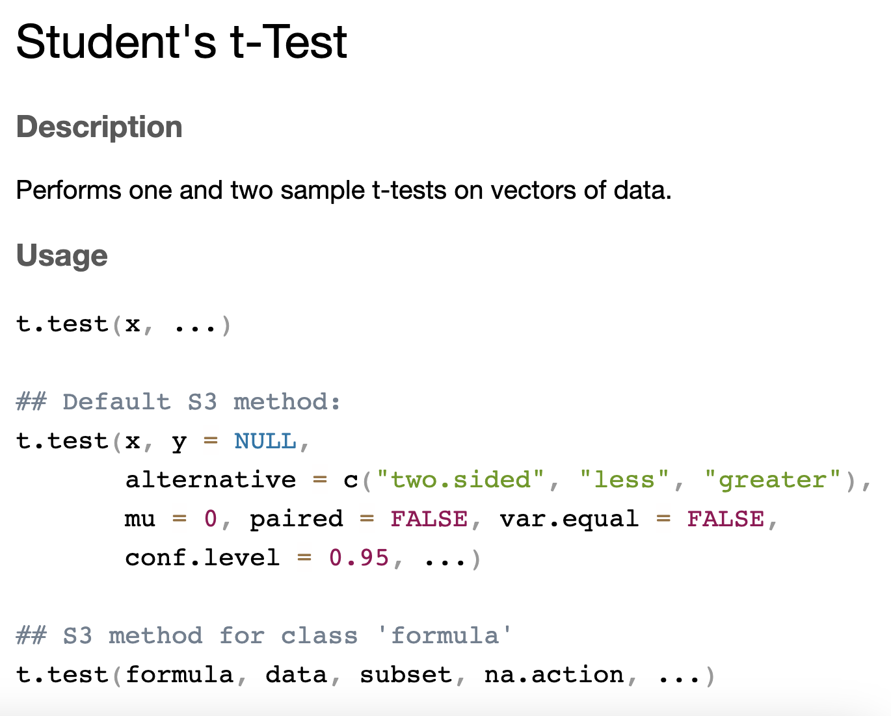
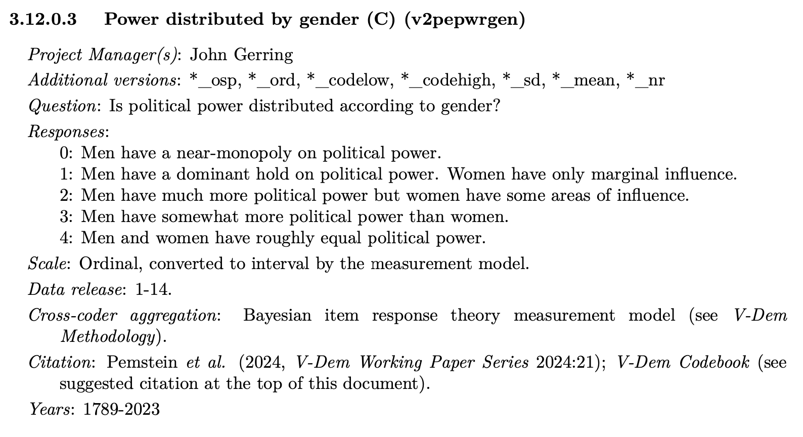

# Regression and confidence intervals

Week 6 tutorial goals:
  * Factors -- `factor()`
  * Difference in means -- `t.test()`
  * Linear regression -- `lm()`
  * Visualizing models using `ggplot`
    + estimates and confidence intervals -- `geom_pointrange()`
    + regression lines
      + `geom_smooth()`
      + `geom_ribbon()`

## Before the start of class
```{r, echo=F}
library(tidyverse)
library(parameters)
```

### Download files from Quercus {-}

Move all the files into your R project `.Rproj` folder

Open your R project

### Install new package and load all packages required for this class {-}
```{r,eval=F}
install.packages("parameters")
library(parameters)
library(tidyverse)
```

### Load data {-}
```{r,echo=F}
ces <- read.csv("data/ces2025_small.csv")
un_country <- read.csv("data/unvotes_country_1947.csv")
```

```{r,eval=F}
ces <- read.csv("ces2025_small.csv")
un_country <- read.csv("unvotes_country_1947.csv")
```

## Recap

### Bar chart for a nominal variable {-}

* born_canada
```{r}
unique(ces$born_canada)
```

```{r}
ggplot(ces, aes(x=born_canada)) +
  geom_bar()
```

The third bar is `NA`: 132 people did not answer the question.

### Determining plot based on type of variable {-}

* Categorical (nominal/ordinal) and categorical -- Stacked bar chart `geom_bar`
* Categorical (nominal/ordinal) and numerical (interval/ratio) -- Box and whiskers `geom_boxplot`
* Numerical (interval/ratio) and numerical -- Scatter plot `geom_point`

* ICAO_region
```{r}
unique(un_country$ICAO_region)
```

```{r}
ggplot(un_country, aes(x=ICAO_region, y=share_yes)) +
  geom_boxplot()
```

## Factors

A **factor** is R's data type for categories. A factor has a fixed set of categories, called **levels**, and the levels have an order. We use `factor()` to turn a variable into a factor. There are two common reasons to do this.

### Numbers that are really categories {-}

The variable `union` asks "Do you belong to a union?". It is coded 1 = yes and 0 = no. The numbers are just labels for two categories, so `union` is a nominal variable. But R stores it as a number.
```{r}
class(ces$union)
```

Because `union` is a number, `ggplot()` treats it as continuous. This boxplot is wrong: it draws one box instead of one box for each group.
```{r}
ggplot(ces, aes(x=union, y=ndp_rating)) +
  geom_boxplot()
```

Notice the x axis: 0.25, 0.50, 0.75. R thinks `union` could be any number between 0 and 1. The warning message about a "continuous x aesthetic" is also a sign that something is wrong.

Wrapping the variable in `factor()` tells R that it is a category.
```{r}
class(factor(ces$union))
```

```{r}
ggplot(ces, aes(x=factor(union), y=ndp_rating)) +
  geom_boxplot()
```

Now there is one box for non-members (0), one for union members (1), and one for people who did not answer (`NA`).

### Setting the order of categories {-}

Text categories are sorted alphabetically, so "Born elsewhere" comes before "Born in Canada".
```{r}
ggplot(ces, aes(x=born_canada, y=con_rating)) +
  geom_boxplot()
```

The `levels` argument of `factor()` sets the order ourselves. Write the categories exactly as they appear in the data.
```{r}
ggplot(ces, aes(x=factor(born_canada, levels=c("Born in Canada","Born elsewhere")), y=con_rating)) +
  geom_boxplot()
```

This only changes the order in the plot. The data stays the same.

## Canadian Election Study data

We use the same 2025 Canadian Election Study (CES) data as last week.\
Stephenson, Laura B., Allison Harell, and Daniel Rubenson. 2025 Canadian Election Study (CES). [dataset]

These are the variables we use today:

| variable      | desc.                                                                             |
|---------------|-----------------------------------------------------------------------------------|
| born_canada   | Where the respondent was born: "Born in Canada" or "Born elsewhere"               |
| union         | Do you belong to a union? (1 = yes, 0 = no)                                       |
| con_rating    | How do you feel about the Conservative Party? (0 = really dislike, 100 = really like) |
| ndp_rating    | How do you feel about the NDP? (0 = really dislike, 100 = really like)            |

Today we compare two groups: people born in Canada and people born elsewhere. Do they feel differently about the parties?

This is a **comparison, not an experiment**. In an experiment, the researcher randomly decides who gets the treatment, so the groups are alike in every other way. Nobody randomly decided where our respondents were born. People born in Canada and people born elsewhere also differ in other ways (for example age, province or religion). So a difference between the groups does not show that where you were born *causes* the difference.

Display first five rows of the dataset.
```{r}
head(ces,5)
```

## Difference in means -- `t.test()`

### Syntax {-}

```{r echo=FALSE, out.width = "70%", fig.align = "center"}

```

The dependent variable and independent variable are separated by a `~`. The dependent variable should be an interval variable (like a 0-100 rating), and the group variable must have exactly two groups. `t.test()` leaves out `NA`s automatically.

  + this is a common format, same for regression

### Outcome 1: Conservative Party rating {-}
```{r}
t.test(con_rating ~ born_canada, data = ces)
```

This output shows the mean of each group and a confidence interval, but it does not show the difference itself. The p-value is also hard to read (`< 2.2e-16` is a very small number).

### Making the output easier to read -- `model_parameters()` {-}

The function `model_parameters()` from the package `parameters` turns the t-test output into a clear table. We pipe the t-test into it.
```{r}
t.test(con_rating ~ born_canada, data = ces) |>
  model_parameters()
```

The table shows the mean of each group, the `Difference`, its 95% confidence interval (`95% CI`) and the p-value (`p`).

Be careful of the direction of the difference. `t.test()` takes the mean of the first group minus the mean of the second group. The groups are in numerical order, or alphabetical order if they are text. So here it is "Born elsewhere" minus "Born in Canada": 51.11 - 42.02 = 9.09.

### Interpreting the difference {-}

#### Mathematical interpretation {-}
Respondents born elsewhere rate the Conservative Party 9.09 points higher (on a 0-100 scale) than respondents born in Canada. The difference is statistically significant (p < .001).

Note that this is points on a 0-100 scale, not percentage points.

#### Substantive interpretation {-}
People who immigrated to Canada feel somewhat warmer toward the Conservatives than people born in Canada. Remember that this is a comparison, not an experiment, so we cannot say that being born outside Canada *causes* people to like the Conservatives more.

### Outcome 2: NDP rating {-}
```{r}
t.test(ndp_rating ~ born_canada, data = ces) |>
  model_parameters()
```

Respondents born elsewhere rate the NDP 0.46 points lower than respondents born in Canada. The difference is not statistically significant (p = 0.401), and the confidence interval includes 0.


## Visualizing differences in means

### Estimates and confidence intervals -- geom_pointrange() {-}

The output of `model_parameters()` is a data frame, so we can pipe it straight into `ggplot()`. Because the estimate is one-dimensional (you only need either x or y), the other dimension can be used as a name label instead of a variable.
```{r}
t.test(con_rating ~ born_canada, data = ces) |>
  model_parameters() |>
  ggplot(aes(y=Difference,x="Conservative rating")) +
  geom_pointrange(aes(ymax=CI_high,ymin=CI_low))
```

`geom_pointrange()` **syntax** (**do not run the following code**)
```{r, eval=F}
ggplot(<name of dataframe>,
       aes(y = Difference, # from the model_parameters() output
           x = "name of x-axis label")) + # x will be the x-axis label
  geom_pointrange(aes(ymax=CI_high,ymin=CI_low)) # from the model_parameters() output
```


#### To highlight whether the difference is statistically significant, we usually add the 0-intercept line {-}
```{r}
t.test(con_rating ~ born_canada, data = ces) |>
  model_parameters() |>
  ggplot(aes(y=Difference,x="Conservative rating")) +
  geom_pointrange(aes(ymax=CI_high,ymin=CI_low)) +
  geom_hline(aes(yintercept=0),linetype="dashed") # this adds a horizontal line
```

#### To beautify the graph, we might change its `theme` and change x and y labels (`xlab` and `ylab`). {-}
Put the direction of the difference in the label, so readers know which group is higher.
```{r}
t.test(con_rating ~ born_canada, data = ces) |>
  model_parameters() |>
  ggplot(aes(y=Difference,x="Conservative rating")) +
  geom_pointrange(aes(ymax=CI_high,ymin=CI_low)) +
  geom_hline(aes(yintercept=0),linetype="dashed") +
  theme_bw() + # black and white theme
  xlab("") + # hides the x label
  ylab("Difference in means (Born elsewhere - Born in Canada)") # replaces the y label
```

The same plot for the NDP rating. Here the confidence interval crosses the dashed 0 line, so the difference is not statistically significant.
```{r}
t.test(ndp_rating ~ born_canada, data = ces) |>
  model_parameters() |>
  ggplot(aes(y=Difference,x="NDP rating")) +
  geom_pointrange(aes(ymax=CI_high,ymin=CI_low)) +
  geom_hline(aes(yintercept=0),linetype="dashed") +
  theme_bw() +
  xlab("") +
  ylab("Difference in means (Born elsewhere - Born in Canada)")
```

You could also flip the x and y.
```{r}
t.test(ndp_rating ~ born_canada, data = ces) |>
  model_parameters() |>
  ggplot(aes(x=Difference,y="NDP rating")) +
  geom_pointrange(aes(xmax=CI_high,xmin=CI_low)) +
  geom_vline(aes(xintercept=0),linetype="dashed") +
  theme_bw() +
  ylab("") +
  xlab("Difference in means (Born elsewhere - Born in Canada)")
```


## Linear regression

### Load a different dataset (some variables from Varieties of Democracies data set) {-}
```{r,echo=F}
vdem <- read.csv("data/vdem_w6tutorial.csv")
```

```{r,eval=F}
vdem <- read.csv("vdem_w6tutorial.csv")
```


* Variables from Varieties of Democracy dataset

  + Power distributed by gender (C) (v2pepwrgen): Q. Is political power distributed according to gender? (0: Men have a near-monopoly power on political power, 4: Men and women have roughly equal political power.)
  + Female journalists (C) (v2mefemjrn): Q. Please estimate the percentage (%) of journalists in the print and broadcast media who are women. (Interval)

### V-Dem codebook {-}
```{r echo=FALSE, out.width = "70%", fig.align = "center"}

```

More details on codebook next week!

```{r}
summary(vdem$v2pepwrgen)
```

### Bivariate relationship using a scatter plot `geom_point()` {-}
```{r}
vdem |>
  ggplot(aes(y=v2pepwrgen,x=v2mefemjrn)) +
  geom_point() +
  theme_classic()
```

```{r,echo=F}
m1 <- lm(data=vdem,v2pepwrgen ~ v2mefemjrn)

vdem$fitted <- m1$fitted.values
vdem$residuals <- m1$residuals

vdem |>
  ggplot(aes(x=v2mefemjrn,y=v2pepwrgen)) +
  geom_point() +
  geom_line(aes(y=fitted)) +
  theme_classic()
```


```{r,echo=F}
vdem |>
  ggplot(aes(x=v2mefemjrn,y=v2pepwrgen)) +
  geom_point(alpha=0.5) +
  geom_point(aes(y=fitted),shape=1,color="maroon") +
  theme_classic()
```


```{r,echo=F}
vdem |>
  ggplot(aes(x=v2mefemjrn,y=v2pepwrgen)) +
  geom_point(alpha=0.5) +
  geom_point(aes(y=fitted),shape=1,color="maroon") +
  geom_segment(aes(yend=fitted,xend=v2mefemjrn),alpha=0.5) +
  theme_classic()
```

```{r,echo=F}
vdem |>
  ggplot(aes(x=v2mefemjrn,y=v2pepwrgen)) +
  geom_point(alpha=0.5) +
  geom_line(aes(y=fitted),color="maroon") +
  geom_segment(aes(yend=fitted,xend=v2mefemjrn),alpha=0.5) +
  theme_classic()
```

#### Visualizing regression line using `geom_smooth()` {-}
```{r}
vdem |>
  ggplot(aes(y=v2pepwrgen,x=v2mefemjrn)) +
  geom_point(alpha=0.5) + # alpha changes the transparency of the points
  geom_smooth(method="lm") +
  theme_classic()
```


## Credits
* This lesson includes materials from
  * [unvotes](https://github.com/dgrtwo/unvotes)

