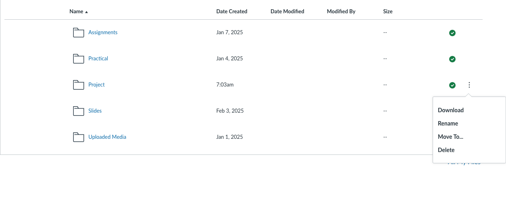
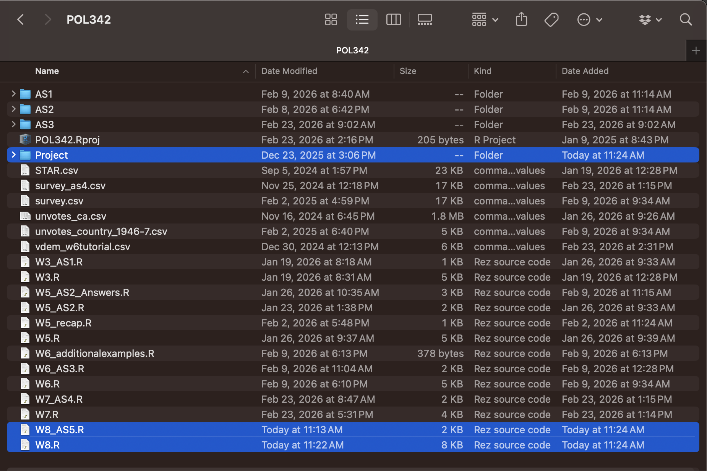
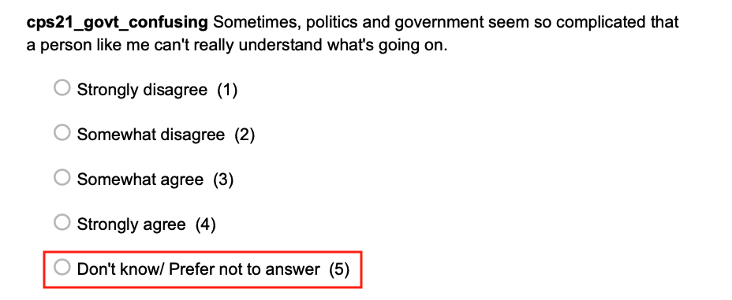

# Introducing project datasets

* Goals for today's class:
  * Learning to use the project datasets
    + Varieties of Democracy (VDem)
    + Canadian Election Study 2021
    + World Values Survey (Wave 7)
    + Asian Barometer (Wave 5)

## Set-up

### Download project datasets {-}
This will take a while because the files are large.
```{r echo=FALSE, out.width = "100%", fig.align = "center"}

```

### Download the other file (`W8.R`) and put everything in your R project folder {-}
```{r echo=FALSE, out.width = "100%", fig.align = "center"}

```


### Load libraries {-}
```{r,echo=F}
library(tidyverse)
library(haven)
library(sjPlot)
```

#### Install package "haven" {-}
```{r,eval=F}
library(tidyverse)
library(sjPlot)

install.packages("haven")
library(haven) # to read Stata .dta files
```

## Overview: Use of data sets

This is the general approach we will take to use the datasets for the project assignment.

### Step 1: Select one of the four data sets {-}

Each data set focuses on a different type of data. You will be selecting variables from *one dataset* for your term project. Take a look at the code book and decide which data set you want to use.

### Step 2: Select your variables {-}

Look at the **codebook** to find your variables.

### Step 3: Trim down the data set {-}

Before examining the variables, it is helpful to trim down your data set to the variables you have selected.

#### Additional step: {-}
* For the following data sets, you have to select a subset of the data
  + VDem: Select a year (from year 2000 onwards)
  + World Values Survey: Select one country
  + Asian Barometer: Select one country

### Step 4: Examine the univariate distribution and bivariate relationship {-}

## VDem
Look at the codebook, which can be found in the same folder as the dataset.

### Step 2: Select your variables {-}

Select the variables you want and assign them to the variable `vars`. I've selected \

* Country name
* Country ID
* Year
* **Political corruption index (v2x_corr)**
* **GDPpercapita (e_gdppc)**

```{r}
vars <- c("country_name", "country_id", "year", 
          "v2x_corr","e_gdppc")
```

```{r echo=FALSE, out.width = "100%", fig.align = "center"}
knitr::include_graphics("images/W7_gdppc.png")
```

```{r echo=FALSE, out.width = "100%", fig.align = "center"}
knitr::include_graphics("images/W7_corr.png")
```

```{r echo=FALSE, out.width = "100%", fig.align = "center"}
knitr::include_graphics("images/W7_corr2.png")
```

### Step 3: Trim down the data set (select a year) {-}

Select a year for analysis and use the `filter` function to extract the data for that year. Please note that the VDem file in your project folder is a reduced version of the original dataset. You can find the original dataset [here](https://www.v-dem.net/data/the-v-dem-dataset/). 
```{r}
vdem_selected <- read.csv("Project/VDem/VDem_post2000.csv") |>
  select(vars) |>
  filter(year==2019)
```

### Step 4: Examine the univariate distribution and bivariate relationship {-}

#### Look at the summary statistics {-}
```{r}
summary(vdem_selected)
```


#### Univariate: Examine each variable {-}

I am going to plot histograms because both of the variables are continuous numerical measures. If you choose a categorical variable, you would visualize the univariate distribution using a bar chart.
```{r}
ggplot(vdem_selected,aes(x=v2x_corr)) +
  geom_histogram()
```

#### GDP per capita is measured in 10,000 PPP-adjusted dollars.

```{r}
ggplot(vdem_selected,aes(x=e_gdppc)) +
  geom_histogram()
```

#### Bivariate relationship {-}

A scatter plot is selected here because both variables are continuuous numerical measures.
```{r}
ggplot(data=vdem_selected,aes(x=v2x_corr,y=e_gdppc)) +
  geom_point()
```

#### Change the theme and transparency of points {-}
```{r}
ggplot(data=vdem_selected,aes(x=v2x_corr,y=e_gdppc)) +
  geom_point(alpha=.5) +
  theme_bw()
```

### Remove all from environment {-}
To avoid any misspecification of variables, clear environment before moving on to the next dataset.
```{r}
rm(list=ls())
```


## World Values Survey (Wave 7, 2017-2022)

### Step 2: Select your variables {-}

Look at the codebook and choose your variables.
```{r}
vars <- c("B_COUNTRY_ALPHA","Q73","Q236") #confidence in political parties, experts versus government
```

### Step 3: Trim down your data set {-}

#### For the WVS data set, select one country {-}

WVS dataset includes a collection of individual surveys in multiple countries. As such, it creates a nested data structure, where we would expect individual-level factors to be confounded by country-level differences. For simplicity, we explore variations within countries.
```{r}
df <- read_rds("Project/WVS/WVS_Cross-National_Wave_7_rds_v6_0.rds") |>
  select(vars) |>
  filter(B_COUNTRY_ALPHA=="CAN") # choice of country: Canada
```

### Step 4: Examine the univariate distribution and bivariate relationship {-}

The response categories contain a mix of ordinal and nominal categories.
```{r}
summary(df)
```

#### Replace nominal categories not found on the ordinal scale to `NA` {-}

```{r echo=FALSE, out.width = "70%", fig.align = "center"}

```

```{r echo=FALSE, out.width = "70%", fig.align = "center"}

```

```{r}
df_recode <- df |>
  mutate(Q73=if_else(Q73<0,
                    NA,
                    Q73),
         Q236=if_else(Q236<0,
                     NA,
                     Q236)) |>
  na.omit() # drops all rows with NA values
```


#### Examine the variables {-}
Examine the variables to make sure they are as you expect them to be after the transformation.
```{r}
summary(df_recode)
```

```{r}
df_recode |>
  ggplot(aes(x=factor(Q73))) +
  geom_bar()
```

```{r}
df_recode |>
  ggplot(aes(x=factor(Q236))) +
  geom_bar()
```


```{r}
tab_xtab(var.col=df$Q73, var.row=df$Q236,
         show.col.prc = TRUE)
```

```{r}
df_recode |>
  ggplot(aes(x=factor(Q73),fill=factor(Q236))) +
  geom_bar(position="fill") +
  theme_bw()
```

```{r}
df_recode |>
  ggplot(aes(x=factor(Q73),fill=factor(Q236))) +
  geom_bar(position="fill") +
  theme_bw() +
  xlab("Lack of Confidence in Parliament") +
  ylab("Proportion") +
  scale_fill_manual(name="Expert versus Govt", #legend label
                    values = c("navyblue","blue","skyblue","grey"), #color specification
                    labels = c("Very Good","Fairly Good", "Fairly Bad", "Very Bad"))
```


### Other countries {-}

#### United States {-}
```{r}
read_rds("Project/WVS/WVS_Cross-National_Wave_7_rds_v6_0.rds") |>
  select(vars) |>
  filter(B_COUNTRY_ALPHA=="USA") |>
  mutate(Q73=if_else(Q73<0,
                    NA,
                    Q73),
         Q236=if_else(Q236<0,
                     NA,
                     Q236)) |>
  na.omit() |>
  ggplot(aes(x=factor(Q73),fill=factor(Q236))) +
  geom_bar(position="fill") +
  theme_bw() +
  xlab("Lack of Confidence in Parliament") +
  ylab("Proportion") +
  scale_fill_manual(name="Expert versus Govt", #legend label
                    values = c("navyblue","blue","skyblue","grey"), #color specification
                    labels = c("Very Good","Fairly Good", "Fairly Bad", "Very Bad"))
```


#### Japan {-}
```{r}
read_rds("Project/WVS/WVS_Cross-National_Wave_7_rds_v6_0.rds") |>
  select(vars) |>
  filter(B_COUNTRY_ALPHA=="JPN") |>
  mutate(Q73=if_else(Q73<0,
                    NA,
                    Q73),
         Q236=if_else(Q236<0,
                     NA,
                     Q236)) |>
  na.omit() |>
  ggplot(aes(x=factor(Q73),fill=factor(Q236))) +
  geom_bar(position="fill") +
  theme_bw() +
  xlab("Lack of Confidence in Parliament") +
  ylab("Proportion") +
  scale_fill_manual(name="Expert versus Govt", #legend label
                    values = c("navyblue","blue","skyblue","grey"), #color specification
                    labels = c("Very Good","Fairly Good", "Fairly Bad", "Very Bad"))
```


### Remove all from environment {-}
To avoid any misspecification of variables, clear environment before moving on to the next dataset.
```{r}
rm(list=ls())
```


## Asian Barometer (Wave 5, 2018-2021)

```{r,include=F,eval=F}
183 How much influence does the United States have on our country?

Independent variable 2: Views toward China
177 Does China do more good or harm to Asia?
181 How much influence does China have on our country?
182 General speaking, the influence China has on our country is?
  
DV: Views toward democracy
171 The citizens in our country are not prepared for a democratic system
172 Democracy negatively affects social and ethical values in our country
```

### Step 2: Select your variables {-}

Look at the codebook and choose your variables. I have chosen the following
```{r,eval=F}
Independent variable: Views toward the US
175 Does the United States do more good or harm to Asia?
184: General speaking, the influence the United States has on our country is?

DV: Views toward democracy (1 strongly agree - 4 strongly disagree)
169 Democratic regimes are indecisive and full of problems
```

```{r}
vars <- c("country","Year",
           "q175","q184",
           "q169")
```

### Step 3: Trim down your data set {-}

#### For the Asian Barometer data set, select one country {-}

```{r}
df <- read_dta("Project/asianbarometer_wave5/20230504_W5_merge_15.dta") |>
  select(vars) |>
  filter(country==3) # South Korea (refer to codebook)

summary(df)
```


#### Replace nominal categories not found on the ordinal scale to `NA` {-}

```{r}
df_recode <- df |>
  mutate(q169 = if_else(q169 > 4, NA, q169),
         q175 = if_else(q175 > 4, NA, q175),
         q184 = if_else(q184 > 4, NA, q184)) |>
  na.omit()
```

### Step 4: Examine the univariate distribution and bivariate relationship {-}

```{r}
df_recode |>
  ggplot(aes(x=factor(q169))) +
  geom_bar()
```

```{r}
df_recode |>
  ggplot(aes(x=factor(q175))) +
  geom_bar()
```


#### Examining the relationship of perceptions of US and views of democracy {-}

#### DV1: q175 {-}
```{r}
df_recode |>
  ggplot(aes(fill=factor(q169),x=factor(q175))) +
  geom_bar(position="fill") +
  theme_bw()
```

#### DV2: q184 {-}
```{r}
df_recode |>
  ggplot(aes(fill=factor(q169),x=factor(q184))) +
  geom_bar(position="fill") +
  theme_bw()
```


## Canadian Election Study 2021

### Step 2: Select your variables {-}

Look at the codebook and choose your variables. 
```{r}
vars <- c("cps21_news_cons","cps21_govt_confusing") #news consumption and internal political efficacy
```

### Step 3: Trim down your data set {-}

For CES2021, we don't need the `year` specification.
```{r}
ces_select <- read_dta("Project/CES2021/2021 Canadian Election Study v2.0.dta") |>
  select(vars)
```

### Step 4: Examine the univariate distribution and bivariate relationship {-}

#### Look at the summary statistics {-}

Note that the ordinal variables are measured as numerical variables.
```{r}
summary(ces_select)
```


#### Examine the variables {-}

Bar chart for ordinal variables. Remember to change the numerical variable into 
```{r}
ggplot(ces_select,aes(x=factor(cps21_news_cons))) +
  geom_bar()
```

```{r}
ggplot(ces_select,aes(x=factor(cps21_govt_confusing))) +
  geom_bar()
```


#### Replace nominal categories not found on the ordinal scale to `NA` {-}

```{r echo=FALSE, out.width = "70%", fig.align = "center"}

```

Use `if_else()` function to manipulate variable
```{r}
ces_dropna <- ces_select |>
  mutate(cps21_govt_confusing=if_else(cps21_govt_confusing==5, #conditional statement
                                     NA, #if yes
                                     cps21_govt_confusing), #if no
         cps21_news_cons=if_else(cps21_news_cons==7, #conditional statement
                                NA, #if yes
                                cps21_news_cons)) |> #if no
  na.omit() #remove NAs
```


#### Bivariate relationship {-}

If both variables nominal/ordinal variable, you can plot the stacked bar chart.
```{r}
ces_dropna |>
  ggplot(aes(x=factor(cps21_news_cons),fill=factor(cps21_govt_confusing))) +
  geom_bar(position="fill") +
  theme_bw()
```


### Remove all from environment {-}
To avoid any misspecification of variables, clear environment before moving on to the next dataset.
```{r}
rm(list=ls())
```


