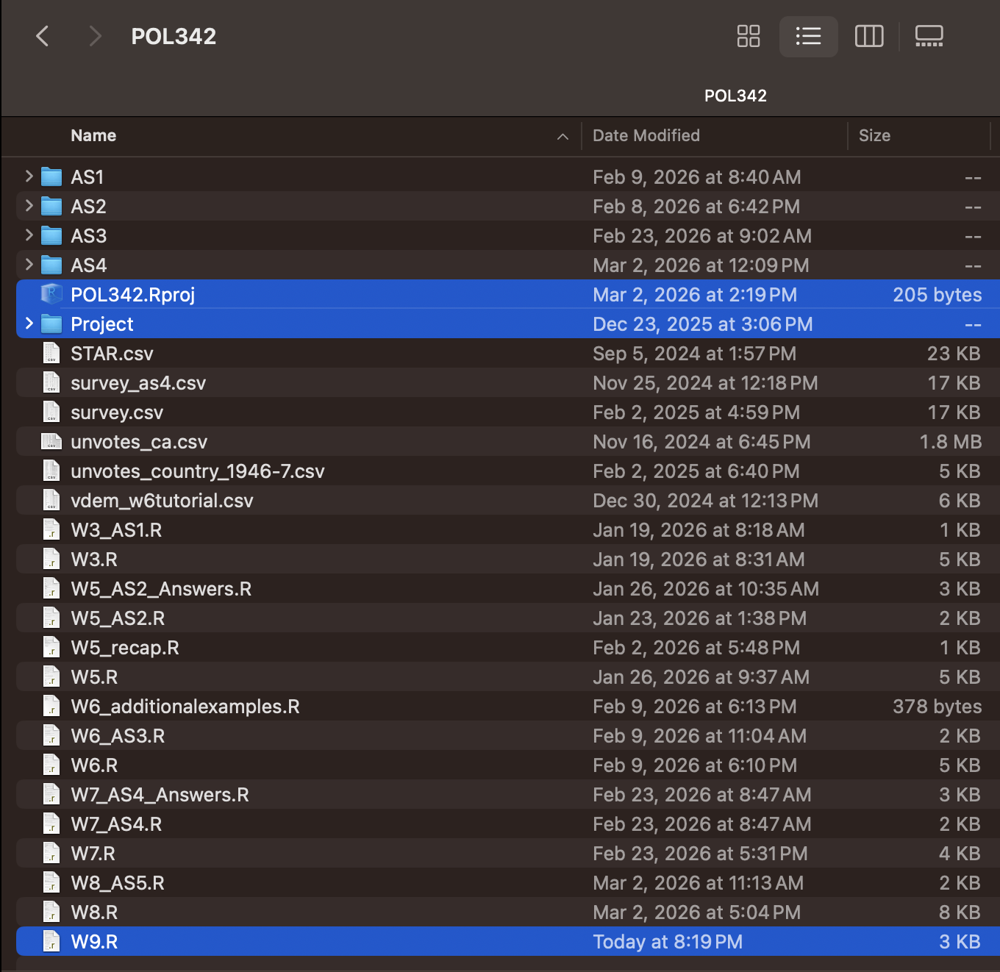
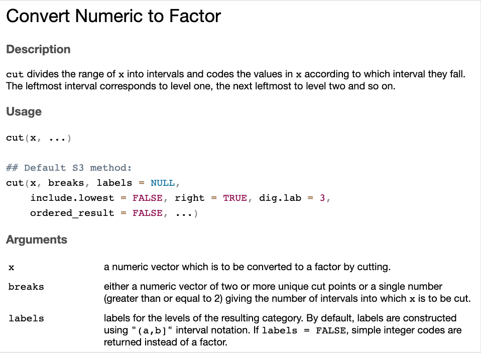
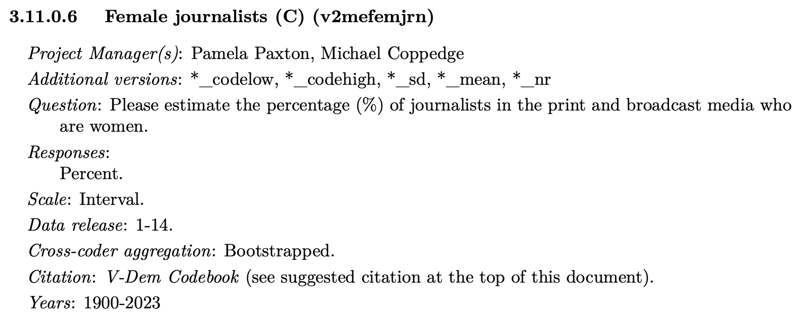

# Crosstabs using continuous variables

* Goals for today's class:
  * Transforming continuous variables into ordinal variables
  * Creating cross-tabs
  * Saving cross-tabs

## Set-up

### Make sure you have your project datasets and `W9.R` {-}
```{r echo=FALSE, out.width = "100%", fig.align = "center"}

```


### Load libraries {-}
```{r}
library(tidyverse)
# install.packages("haven") # if you haven't installed the package
library(haven)
library(sjPlot)
```

## VDem

### Load Data {-}
```{r}
vars <- c("country_name", "country_id", "year", 
          "v2x_libdem","e_gdppc","v2mefemjrn", "v2pepwrgen")

vdem_selected <- read.csv("Project/VDem/VDem_post2000.csv") |>
  select(all_of(vars)) |>
  filter(year==2010) 
```

* Variables selected:
  * `v2x_libdem`: Liberal democracy index
  * `e_gdppc`: GDP per capita
  * `v2mefemjrn`: % of female journalist
  * `v2pepwrgen`: Power distributed by gender

### Create ordinal categories using function `cut()` {-}
```{r}
?cut # pull up the documentation for `cut()`
```

```{r echo=FALSE, out.width = "100%", fig.align = "center"}

```

#### Consider this variable: v2mefemjrn (% of female journalists) {-}
```{r echo=FALSE, out.width = "100%", fig.align = "center"}

```

```{r}
head(vdem_selected$v2mefemjrn)
```


```{r}
cut(vdem_selected$v2mefemjrn, # numeric variable
    breaks=4) |> # either number of intervals OR list of cut points
  head()

cut(vdem_selected$v2mefemjrn, # numeric variable
    breaks=c(10,30,50,70)) |> # either number of intervals OR list of cut points
  head()
```

#### Create a new dataframe with new ordinal variables {-}
```{r}
crosstab <- vdem_selected |>
  mutate(v2mefemjrn_ord4 = cut(v2mefemjrn, 
                              breaks = 4),
         v2pepwrgen_ord4 = cut(v2pepwrgen, 
                                 breaks = 4))
```

#### Crosstabs {-}
```{r}
tab_xtab(var.row = crosstab$v2mefemjrn_ord4,
         var.col = crosstab$v2pepwrgen_ord4,
         show.col.prc = TRUE)
```

#### Export table {-}
```{r}
tab_xtab(var.row = crosstab$v2mefemjrn_ord4,
         var.col = crosstab$v2pepwrgen_ord4,
         show.col.prc = TRUE,
         file="crosstabs.html")
```


For your final project, open the html file on your laptops and copy the table into your word document

### Skewed variables {-}
```{r}
ggplot(vdem_selected,aes(x=e_gdppc)) +
  geom_histogram()
```

#### Crosstabs will not display well {-}
```{r}
crosstab2 <- vdem_selected |>
  mutate(e_gdppc_ord4 = cut(e_gdppc, 
                            breaks = 4),
         v2x_libdem_ord4 = cut(v2x_libdem, 
                          breaks = 4))

tab_xtab(var.row = crosstab2$e_gdppc_ord4,
         var.col = crosstab2$v2x_libdem_ord4,
         show.col.prc = TRUE)
```


#### Alternative using quantile cut points {-}
```{r}
quantile(vdem_selected$e_gdppc, probs = seq(0, 1, 0.25),na.rm=T)
```

```{r}
crosstab3 <- vdem_selected |>
  mutate(e_gdppc_ord4 = cut(e_gdppc, 
                            breaks = quantile(e_gdppc, probs = seq(0, 1, 0.25),na.rm=T)),
         v2x_libdem_ord4 = cut(v2x_libdem, 
                               breaks = quantile(v2x_libdem, probs = seq(0, 1, 0.25),na.rm=T)))

tab_xtab(var.row = crosstab3$v2x_libdem_ord4,
         var.col = crosstab3$e_gdppc_ord4,
         show.col.prc = TRUE)
```

