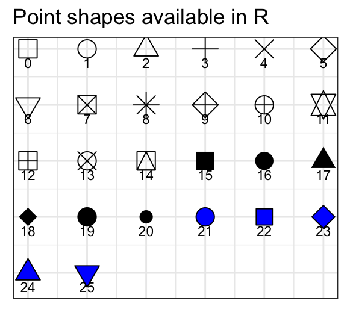

# Optimizing ggplot presentation

* Goals for today's class:
  * Optimizing ggplot presentation for each of the plot types (bar charts, box and whiskers, scatter plot)
  * Other graph specifications (themes, axes, font size, etc.)


```{r, include=FALSE}
library(tidyverse)
library(haven)
library(marginaleffects)
library(ggExtra)
options(warn = -1) # suppress warning messages that do not disturb the program flow
```

## Load libraries
```{r,eval=F}
library(tidyverse)
library(haven)
library(marginaleffects)
```


## Bar charts

### Prepare variables (Asian Barometer) {-}

* Independent variable: Views toward the US
  * 175 Does the United States do more good or harm to Asia?

* Dependent variable: Views toward democracy (1 strongly agree - 4 strongly disagree)
  * 170 Democratic systems are not effective at maintaining order and stability

#### Load data and select variables {-}
```{r}
vars <- c("country","Year",
           "q170","q175")

df <- read_dta("Project/asianbarometer_wave5/20230504_W5_merge_15.dta") |>
  select(all_of(vars)) |>
  filter(country==11) # Vietnam
```

#### Recode variables {-}
```{r}
df_recode <- df |>
  mutate(q170 = ifelse(q170<1 | q170 > 4, NA, q170),
         q175 = ifelse(q175<1 | q175 > 4, NA, q175)) |>
  na.omit()
```

```{r,include=F,eval=F}
m <- lm(data=df_recode,
        q170 ~ q175)

m2 <- lm(data=df_recode,
        q170 ~ q177)

m_controls <- lm(data=df_recode,
        q170 ~ q175 + q177 + Se9c_4)
```

#### Basic plot {-}
```{r}
df_recode |>
  ggplot(aes(fill=factor(q170),x=factor(q175))) +
  geom_bar(position="fill")
```

* `theme_bw()` -- changes the background theme
* `scale_fill_manual` -- `name` to label legend title, `values` to change colors, `labels` to change name of levels
* `scale_x_discrete` -- adjusts x-axis; `labels` to change name of levels; `guide` to stagger labels to prevent overlapping
* `xlab` -- x-axis title
* `ylab` -- y-axis title
* `geom_text` -- adds text annotation


```{r}
df_recode |>
  ggplot(aes(fill=factor(q170),x=factor(q175))) +
  geom_bar(position="fill") +
  theme_bw()
```

```{r}
df_recode |>
  ggplot(aes(fill=factor(q170),x=factor(q175))) +
  geom_bar(position="fill") +
  theme_bw() +
  scale_fill_manual(name="Q170. Democratic\nsystems are not\neffective", #legend label; `\n` breaks line
                    values = c("navyblue","blue","skyblue","grey"), #color specification
                    labels = c("Strongly Agree","Somewhat Agree", "Somewhat Disagree", "Strongly Disagree")) #legend specification
```

```{r}
df_recode |>
  ggplot(aes(fill=factor(q170),x=factor(q175))) +
  geom_bar(position="fill") +
  theme_bw() +
  scale_fill_manual(name="Q170. Democratic\nsystems are not\neffective", #legend label; `\n` breaks line
                    values = c("navyblue","blue","skyblue","grey"), #color specification
                    labels = c("Strongly Agree","Somewhat Agree", "Somewhat Disagree", "Strongly Disagree")) + #legend specification
  scale_x_discrete(labels=c("Much more good", "Somewhat more good", "Somewhat more harm", "Much more harm"),
                   guide = guide_axis(n.dodge=2)) +
  xlab("Q175. Does the United States do more good or harm to Asia?") +
  ylab("Proportion")
```


```{r}
df_recode |>
  ggplot(aes(fill=factor(q170),x=factor(q175))) +
  geom_bar(position="fill") +
  theme_bw() +
  scale_fill_manual(name="Q170. Democratic\nsystems are not\neffective", #legend label; `\n` breaks line
                    values = c("navyblue","blue","skyblue","grey"), #color specification
                    labels = c("Strongly Agree","Somewhat Agree", "Somewhat Disagree", "Strongly Disagree")) + #legend specification
  scale_x_discrete(labels=c("Much more good", "Somewhat more good", "Somewhat more harm", "Much more harm"),
                   guide = guide_axis(n.dodge=2)) +
  xlab("Q175. Does the United States do more good or harm to Asia?") +
  ylab("Proportion") +
  geom_text(aes(x = factor(q175), # position along x axis follows q175
                label = round(after_stat(count / tapply(count, x, sum)[x]),3)), # text
            stat = "count",
            position = position_fill(vjust = .5), # position text at center of each fill block
            color="white")
```

### Clear environment {-}
```{r}
rm(list=ls())
```


## Box and whiskers plot

### Prepare variables (CES) {-}
```{r}
vars <- c("pes21_groups1_4","cps21_news_cons","cps21_govt_confusing") #news consumption and internal political efficacy

ces_select <- read_dta("Project/CES2021/2021 Canadian Election Study v2.0.dta") |>
  dplyr::select(all_of(vars))

ces_dropna <- ces_select |>
  mutate(cps21_govt_confusing=ifelse(cps21_govt_confusing==5, #conditional statement
                                     NA, #if yes
                                     cps21_govt_confusing), #if no
         cps21_news_cons=ifelse(cps21_news_cons==7, #conditional statement
                                NA, #if yes
                                cps21_news_cons), #if no
         pes21_groups1_4=ifelse(pes21_groups1_4<0,
                                NA,
                                pes21_groups1_4)) |> 
  na.omit() #remove NAs
```


```{r}
ggplot(ces_dropna, aes(x=factor(cps21_govt_confusing), y=pes21_groups1_4)) +
  geom_boxplot()
```

* `width` in `geom_boxplot` controls the width of the boxplot
* `geom_point(stat="summary, fun=mean)` adds a point plot of the conditional mean in addition to the quartiles noted in the box and whiskers
* ggplot shapes for point or scatter

```{r echo=FALSE, out.width = "60%", fig.align = "center"}

```

```{r}
ggplot(ces_dropna, aes(x=factor(cps21_govt_confusing), y=pes21_groups1_4)) +
  geom_boxplot(width=0.3, fill="darkseagreen") +
  geom_point(stat="summary", fun=mean, shape=23, fill="black",size=2.5) +
  scale_x_discrete(labels=c("1\nStrongly Disagree","Somewhat Disagree","Somewhat Agree","4\nStrongly Agree")) +
  theme_bw() +
  xlab("Sometimes, politics and government seem so complicated that a person\n like me can't really understand what's going on.") +
  ylab("How do you feel about the following groups in Canada\n [politicians in general]?")
```

### Clear environment {-}
```{r}
rm(list=ls())
```

## Scatter plot

### Prepare variables (VDem) {-}
```{r}
vars <- c("country_name", "country_id", "year", 
          "e_cow_exports","e_gdppc","e_gdp","e_cow_imports","v2x_pubcorr")

vdem_selected <- read.csv("Project/VDem/VDem_post2000.csv") |>
  select(all_of(vars)) |>
  filter(year==2014)

df <- vdem_selected |>
  mutate(trade = (e_cow_exports+e_cow_imports)/(e_gdp)) # trade volume as proportion of gdp

ggplot(data=df,aes(x=trade,y=v2x_pubcorr)) +
  geom_point()

ggplot(data=df,aes(x=log(trade),y=v2x_pubcorr)) +
  geom_point()
```


#### Consider including your main control variable in the bivariate plot {-}

For example, the bivariate scatter seems to support a theory that reliance of economy on trade is associated with lower levels of public sector corruption. However, when GDP per capita is included, the plot shows that countries that rely on trade also tend to be richer. In other words, we may not have sufficient variation to disentangle the effects of trade reliance from developed economies.

```{r}
ggplot(data=df,aes(x=log(trade),y=v2x_pubcorr)) +
  geom_point(aes(color=log(e_gdppc)),alpha=0.8,size=2) +
  theme_classic() +
  xlab("Trade volume as proportion of GDP") +
  ylab("Public sector corruption") +
  scale_color_gradient(name="GDP per capita (logged)",
                       low="black",high="red")
```


### Saving plots using `ggsave()` {-}

```{r}
# save as object
plt <- ggplot(data=df,aes(x=log(trade),y=v2x_pubcorr)) +
  geom_point(aes(color=log(e_gdppc)),alpha=0.8,size=2) +
  theme_classic() +
  xlab("Total trade per capita (logged)") +
  ylab("Public sector corruption") +
  scale_color_gradient(name="GDP per capita (logged)",
                       low="black",high="red")

# use ggsave()
ggsave(filename="plt.png",plot=plt)
```

### Using measures from other datasets {-}

If you want to include data from other data sets, you must receive approval from the TAs or Prof. Besco prior to submission.

```{r}
cowSL <- read.csv("data/statelist2024.csv")
library(countrycode)

cowSL$ccode_vdem <- countrycode(cowSL$ccode,
                                origin="cown",
                                destination="vdem")

cowSL2 <- cowSL |>
  filter(ccode_vdem %in% vdem_selected$country_id) |>
  group_by(ccode) |>
  slice_min(styear) # using the earliest year for states that re-enter the system

df2 <- left_join(df, 
          cowSL2[,c("ccode_vdem","styear")],
          by=c("country_id" = "ccode_vdem"))

ggplot(data=df2,aes(x=log(trade),y=v2x_pubcorr)) +
  geom_point(aes(color=styear),alpha=0.8,size=2) +
  theme_classic() +
  xlab("Trade volume as proportion of GDP") +
  ylab("Public sector corruption") +
  scale_color_gradient(name="First year in state system",
                       low="black",high="red")
```

### Clear environment {-}
```{r}
rm(list=ls())
```
